# CPOR Industry Engagement — Global Industry Catalog

> **CPOR Durable** · Dynamics 365 Sales · Dataverse Catalog Tier Extension + Industry CRM Layer  
> Last updated: June 2026 · Architecture revision: Registration Qualification BPF + Territory Manager Approval Gate + Sales Research Agents

---

## Who This Document Is For

| Audience | Key sections |
|---|---|
| **Account Executives** | [Why This Matters to Sellers](#why-this-matters-to-sellers) · [How Your Lead & Account Update Automatically](#how-your-lead--account-update-automatically) · [What You See on a Hypothesis](#what-you-see-on-a-hypothesis) |
| **Territory Managers** | [Your Role: Approval Gate](#territory-manager-approval-gate) · [Sales Research Agents](#dynamics-365-sales-research-agents) · [5-Stage Qualification Flow](#5-stage-registration-qualification-flow) · [Flow 4: TM Approval Automation](#flow-4--territory-manager-approval) · [Flow 5: Health Report to AE](#flow-5--territory-compliance-health-report-to-ae) |
| **IT Stakeholders** | [Solution Architecture](#solution-architecture) · [Data Model](#data-model) · [Integration Points](#integration-points) · [Security Model](#security-model) · [Implementation Roadmap](#implementation-roadmap) |
| **Global Industry Team** | [CPOR Industry Catalog App](#cpor-industry-catalog-app) · [Catalog Health Dashboard](#catalog-health-dashboard) · [Registration Wizard](#registration-wizard--new-entry-dialog) · [All Guides](#implementation-guides-index) |

---

## Table of Contents

- [Why This Matters to Sellers](#why-this-matters-to-sellers)
- [Project Overview](#project-overview)
- [Microsoft Sales Industry Context](#microsoft-sales-industry-context)
- [Solution Architecture](#solution-architecture)
- [Data Model](#data-model)
- [CPOR Industry Catalog App](#cpor-industry-catalog-app)
  - [Catalog Health Dashboard](#catalog-health-dashboard)
  - [Registration Wizard — New Entry Dialog](#registration-wizard--new-entry-dialog)
  - [5-Stage Registration Qualification Flow](#5-stage-registration-qualification-flow)
  - [Territory Manager Approval Gate](#territory-manager-approval-gate)
- [How Your Lead & Account Update Automatically](#how-your-lead--account-update-automatically)
- [What You See on a Hypothesis](#what-you-see-on-a-hypothesis)
- [Dynamics 365 Sales Research Agents](#dynamics-365-sales-research-agents)
- [Cross-Team Workflow](#cross-team-workflow)
- [Power Automate Flows](#power-automate-flows)
- [Industry Crosswalk Reference Data](#industry-crosswalk-reference-data)
- [Integration Points](#integration-points)
- [Security Model](#security-model)
- [Implementation Roadmap](#implementation-roadmap)
- [Implementation Guides Index](#implementation-guides-index)
- [Verification Reference](#verification-reference)

---

## Why This Matters to Sellers

> **The problem this solves:** Every regulatory claim the CPOR pipeline generated before this extension was recalled from AI model training — free-text, inconsistent, hallucination-prone, and untraceable. No audit trail. No ownership. No deadline tracking.

### What changes for Account Executives

| Before | After |
|---|---|
| Pipeline hypothesis says "GDPR may apply" — no source, no date | Hypothesis links directly to a verified EU GDPR (2016/679) record naming the regulator (EDPB), risk rating (High), compliance deadline, and the analyst who verified it |
| You set "Financial" in the Industry picklist and it stops there | Setting "Financial" on a Lead automatically populates the D365 FK to the catalog, grounding all downstream AI claims to that industry's verified regulatory profile |
| You need to know the regulation yourself to ask the right questions | Stage 0 surfaces the highest-risk, freshest regulations for your customer's industry × territory intersection before you enter the meeting |
| Regulatory claims in exec presentations can't be cited | Every claim traces to `cpor_legislationurl`, `cpor_regulatorbodyname`, and a `cpor_lastverifieddate` — citable and auditable |

### What changes for Territory Managers

You are now a **quality gate** in the registration lifecycle. Before any regulatory record can move from `Pending` to `Active` and reach the AI pipeline, you must:

1. Receive an automated approval request (Teams or email) from Power Automate Flow 4
2. Review the registration — industry code, territory, legislation URL, risk rating, analyst notes
3. Approve or reject with comments

Only TM-approved records are classified `Active` and included in Stage 0 pipeline grounding. This is the trust boundary between analyst research and seller-facing regulatory intelligence.

---

## Project Overview

The CPOR Industry Engagement project extends the deployed **CPOR Dynamics 365 Sales** solution with a two-layer capability:

| Layer | Purpose |
|---|---|
| **Dataverse Catalog Tier** (GII) | Provides authoritative reference data: industry codes, compliance domains, territory hierarchy, regulatory sources, crosswalk maps, and verified regulatory registrations |
| **Industry CRM Layer** (CRM) | Delivers a dedicated Model Driven App — _CPOR Industry Catalog_ — for the Global Industry Team to curate, manage, and health-check that catalog data |

**Result:** Each Regulatory hypothesis carries a foreign key to a `cpor_RegulatoryRegistration` record naming the specific law, regulator, URL, risk rating, and compliance deadline — verified by a human analyst and approved by a Territory Manager.

---

## Microsoft Sales Industry Context

<details>
<summary><strong>Microsoft Sales Analysis — Key Takeaways (expand)</strong></summary>

### Revenue Context

Microsoft reported **$82.9B revenue in FY26 Q3** (+18% YoY), with FY2025 annual revenue of **$281.7B** and Microsoft Cloud revenue of **$168.9B** (+23%).

### Primary Demand Drivers

| Driver | CPOR Relevance |
|---|---|
| AI adoption | Pipeline hypothesis generation; Copilot readiness scores |
| Security consolidation | Compliance domain mapping (CYBER, PRIV, FIN) |
| Cloud migration | Azure modernization hypotheses |
| Data governance | Regulatory grounding of sales claims |
| Industry-specific solutions | Industry Cloud Vertical alignment per account |

### Microsoft's Industry Research Methodology

Microsoft's MCAPS industry research follows a repeatable lifecycle:

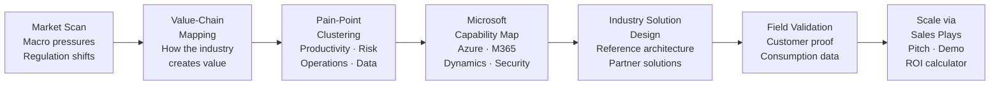

### Research-to-Revenue Formula

> **Industry insight + business outcome + Microsoft platform + partner specialization + proof of value = scalable sales motion**

</details>

---

## Solution Architecture

The catalog is organized in three tiers. The AI pipeline (Stage 0 `referenceResolver.js`) queries down through all three tiers to build the `groundingContext` object passed to all subsequent stages.

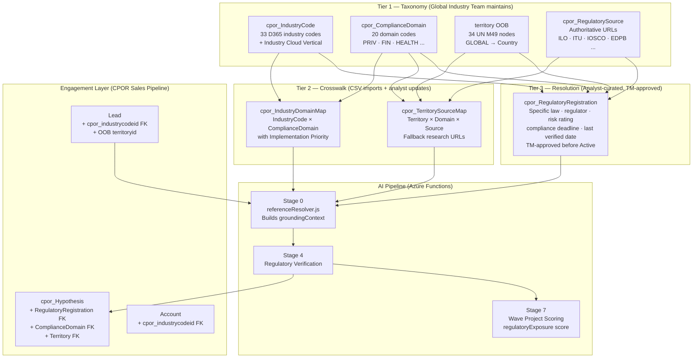

### 180-Day Freshness Gate

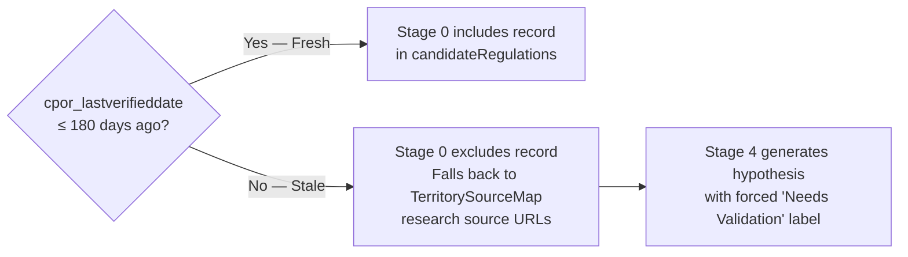

---

## Data Model

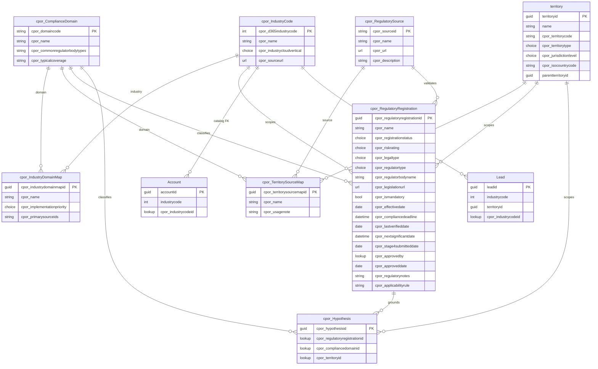

<details>
<summary><strong>Registration Status Optionset — cpor_registrationstatus</strong></summary>

| Label | Value | Meaning |
|---|---|---|
| **Pending** | 154080002 | Draft — analyst capturing initial details; not yet taxonomy-validated |
| **Pending TM Review** | 154080003 | Analyst complete — awaiting Territory Manager sign-off via Flow 4 |
| **Active** | 154080000 | TM-approved — included in Stage 0 pipeline grounding |
| **Superseded** | 154080001 | Retired — excluded from pipeline; form fields locked (except Analyst Notes) |

> Only records with status **Active** are returned by Stage 0 `referenceResolver.js`. All other statuses are invisible to the AI pipeline.

</details>

---

## CPOR Industry Catalog App

The **CPOR Industry Catalog** is a dedicated Model Driven App accessible only to users with the `CPOR Global Industry Team` security role. It is the operational hub for the Global Industry Team.

**App structure:**

```
Dashboard
  └── My Work
      └── Catalog Health  ← interactive HTML landing page (web resource)

Taxonomy
  └── Reference Data
      ├── Industry Codes      (33 records)
      ├── Compliance Domains  (20 records)
      ├── Territories         (34 CPOR nodes, filtered cpor_territorycode ≠ null)
      └── Regulatory Sources  (24+ records)

Crosswalk
  └── Mapping Tables
      ├── Industry Domain Maps
      └── Territory Source Maps

Registrations
  └── Regulatory Catalog
      └── Regulatory Registrations  ← primary working entity
          Views: Active · Stale · Deadlines · High Risk · By Vertical · Superseded/Pending
```

---

### Catalog Health Dashboard

The Catalog Health dashboard is the **default landing page** when any Global Industry Team member opens the CPOR Industry Catalog app. It is implemented as an interactive HTML/JS web resource (`cpor_catalog_health.html`) — not a standard MDA dashboard — to enable richer visualizations and real-time KPI data.

**Load experience:** The Microsoft logo fades in on load, then transitions to the live dashboard.

**Four operational panels:**

| Panel | Data shown | Query |
|---|---|---|
| **Active by Vertical** | Inline SVG bar chart — count of Active registrations grouped by Industry Cloud Vertical | `cpor_regulatoryregistrations?$filter=cpor_registrationstatus eq 154080000&$expand=cpor_IndustryCode($select=cpor_industrycloudvertical)` |
| **Stale — Needs Reverification** | Records with `cpor_lastverifieddate` > 180 days old; red age indicator | `cpor_lastverifieddate lt [today−180d]` |
| **Approaching Deadlines** | Active records with `cpor_compliancedeadline` within 90 days; countdown chip | `cpor_compliancedeadline le [today+90d]` |
| **High Risk — Active** | Active records with `cpor_riskrating = High`; risk badge + deadline chip | `cpor_riskrating eq 154080000` |

**KPI summary row** (top of dashboard): Total Active · Stale Count · Deadlines ≤ 90 days · High Risk count — all load in parallel via `Promise.all`.

---

### Registration Wizard — New Entry Dialog

Analysts enter new registrations via a **4-step interactive modal wizard** (`cpor_new_registration_dialog.js`) launched from the Registration Manager page. The wizard guides entry and prevents submission of incomplete records.

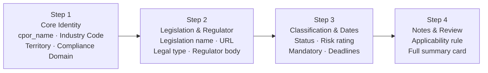

**Step 1** is gated — Industry Code, Territory, and Compliance Domain are required before advancing. Lookups for all four FK fields are loaded in parallel on dialog open and cached for the session.

**Payload on save** calls `Xrm.WebApi.createRecord('cpor_regulatoryregistration', payload)` using the correct Dataverse navigation property names for all lookup bindings:

| Field | Navigation property |
|---|---|
| Industry Code | `cpor_IndustryCode@odata.bind` |
| Territory | `cpor_Territory@odata.bind` |
| Compliance Domain | `cpor_ComplianceDomain@odata.bind` |
| Regulatory Source | `cpor_RegulatorySource@odata.bind` |

New records are created with `cpor_registrationstatus = Pending (154080002)` and enter the Business Process Flow at **Stage 1: Draft**.

---

### 5-Stage Registration Qualification Flow

Every `cpor_RegulatoryRegistration` record moves through a 5-stage Business Process Flow from analyst draft to TM-approved Active status.

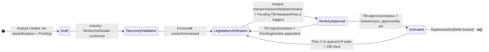

| Stage | Owner | Required fields | Notes |
|---|---|---|---|
| **1 — Draft** | Global Industry Team | `cpor_name`, `cpor_legislationname`, `cpor_legaltype` | Entry point for wizard-created records |
| **2 — Taxonomy Validation** | Global Industry Team | `cpor_industrycode`, `cpor_territory`, `cpor_compliancedomain` | Sub-grids show domain/source crosswalk context; TM manager check |
| **3 — Legislation Verification** | Global Industry Team | `cpor_legislationurl`, `cpor_riskrating`, `cpor_ismandatory`, `cpor_lastverifieddate` | **Re-entry point** for Flow 1 stale requeue and TM rejections |
| **4 — Territory Approval** | **Territory Manager** | `cpor_approvedby` (auto), `cpor_approveddate` (auto) | TM approves or rejects via Flow 4 Approvals connector |
| **5 — Activated** | System (terminal) | `cpor_registrationstatus = Active` | Record visible to Stage 0 pipeline |

---

### Territory Manager Approval Gate

**This is your primary touchpoint as a Territory Manager.**

When an Industry Analyst completes verification of a regulatory registration and sets its status to **Pending TM Review**, Power Automate Flow 4 automatically:

1. Reads the registration's Territory record and looks up its assigned `managerid`
2. Retrieves your user profile from Dataverse
3. Sends you an **Approval request** via Microsoft Teams Adaptive Card (or email fallback) containing:
   - Registration name and legislation details
   - Industry Code, Territory, Compliance Domain
   - Risk rating and compliance deadline
   - A direct link to the full form
   - Analyst notes / jurisdiction caveats

**Your two actions:**

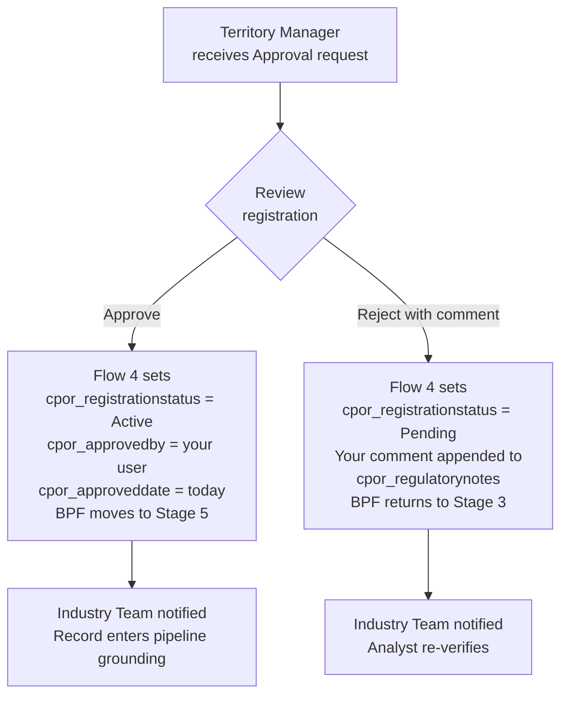

> **Important:** If your territory does not have a `managerid` assigned in Dataverse, Flow 4 will revert the status to Pending and notify the Industry Team. Make sure your territory records have a Territory Manager assigned — this is a prerequisite for the approval workflow.

**What you are signing off on:**

- The legislation URL is valid and points to the authoritative source
- The jurisdiction scoping (territory) is correct for this law
- The risk rating and mandatory flag reflect your understanding of the territory's regulatory environment
- The compliance deadline, if set, is accurate

Once you approve, the record becomes `Active` and is included in AI pipeline grounding for all accounts and leads in your territory that match the industry code.

---

## How Your Lead & Account Update Automatically

As an Account Executive, you do **not** need to interact with the CPOR Industry Catalog directly. Your existing seller workflow triggers automatic population of the catalog FKs.

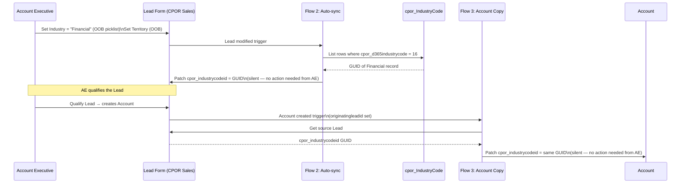

**What this means for you:** Set the standard OOB Industry picklist on your Lead (which you're already doing). That's it. Both the Lead and the resulting Account automatically inherit the catalog FK, which Stage 0 reads when generating regulatory hypotheses for your engagement.

> **One Lead = One Territory** is by design. If a customer like Toyota operates in both Japan (APAC-JP) and EMEA, create separate Leads per jurisdiction to get jurisdiction-specific regulatory grounding. Parent account mapping uses standard D365 account hierarchy.

---

## What You See on a Hypothesis

After the AI pipeline runs, each `cpor_Hypothesis` record shows a **Regulatory Grounding** section with three FK fields:

| Field | What it shows | Value example |
|---|---|---|
| `cpor_regulatoryregistrationid` | The specific law/regulation that grounds this claim | EU — GDPR (2016/679) |
| `cpor_compliancedomainid` | The compliance domain classification | PRIV — Data protection & privacy |
| `cpor_territoryid` | The jurisdiction this hypothesis applies to | EMEA — European Union |

Clicking the `cpor_regulatoryregistrationid` link opens the full Registration record showing:
- Regulator name and website
- Legislation URL (citable in exec presentations)
- Risk rating (High / Medium / Low)
- Compliance deadline
- Last verified date and the Territory Manager who approved it
- Analyst jurisdiction notes

> **For executive conversations:** You can cite the specific law, regulator, and deadline directly from the Hypothesis. The record is human-verified by your Territory Manager — not generated by the AI.

---

## Dynamics 365 Sales Research Agents

The catalog and the BPF keep the regulatory data *trustworthy*. The **Sales Research Agents** make that data *conversational* — they let a Territory Manager (TM) and Account Executive (AE) ask plain-language questions and get grounded, territory-scoped answers without writing a single query.

Three agents ship in this revision, each mapped to a distinct business function. All three are **built on Microsoft Copilot for Dynamics 365 Sales** (Copilot Studio authoring, surfaced in the Sales Hub), and all three are **read-only** — they surface, summarise, and brief, but they never change a registration. Every approve / reject / re-verify action stays in the Flow 4 approval email and the CPOR app form, behind the Field Security Profile.

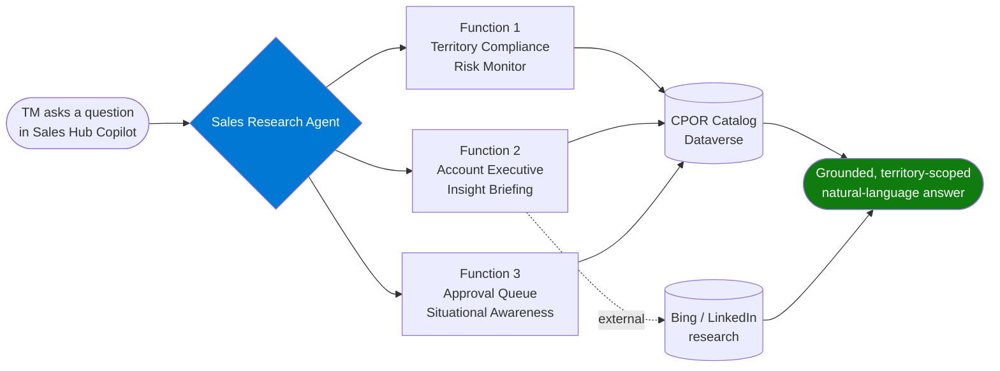

<details>
<summary><strong>How the agents stay scoped to the right territories</strong> (identity, OR-chains, capacity)</summary>

<br>

Every agent answer is anchored to **the TM who is asking**. The traversal is the same OOB relationship chain Flow 5 uses:

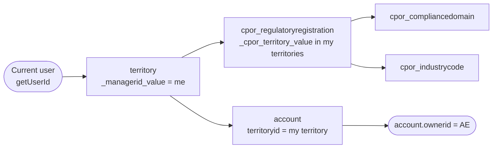

- **Identity anchor** — the agent resolves the signed-in user with `Xrm.Utility.getGlobalContext().getUserId()` (curly braces stripped). This is the same `getCurrentUserId()` helper added to `cpor_xrm_client.js` in GII Guide 11.
- **Scope query** — `GET /territories?$filter=_managerid_value eq {userId}` returns the TM's territory GUIDs.
- **No `$in` operator** — Dataverse Web API does not support `$in` on lookups, so registrations are filtered with an explicit **OR chain**: `_cpor_territory_value eq 'id1' or _cpor_territory_value eq 'id2' …`.
- **Licensing & capacity** — the agents consume **Copilot message credits** (Copilot capacity). The Sales Qualification flavour requires **D365 Sales Premium**. Agents are created by a **System Customizer** in the Sales Hub and assigned the **CPOR Territory Manager** security role (GII Guide 08).

</details>

### The Risk × Time signal matrix

Every agent reasons over the same two-axis model. Risk rating (mandatory vs optional) crossed with time urgency (deadline / staleness) produces four actionable quadrants:

```mermaid
quadrantChart
    title Risk x Time — what each obligation deserves
    x-axis Low urgency (>90 days / stable) --> High urgency (<90 days / stale)
    y-axis Low risk (optional) --> High risk (mandatory)
    quadrant-1 ESCALATE TO AE NOW (Flow 5)
    quadrant-2 MONITOR (quarterly)
    quadrant-3 ROUTINE (annual)
    quadrant-4 REVIEW (weekly TM digest)
```

| Quadrant | Condition | Cadence | Channel |
|---|---|---|---|
| **ESCALATE TO AE NOW** | Mandatory **and** deadline within 90 days | Immediate | Flow 5 → AE Task |
| **MONITOR** | Mandatory **and** deadline beyond 90 days | Quarterly | TM review |
| **REVIEW** | Optional **and** last verified > 180 days | Weekly | TM digest |
| **ROUTINE** | Optional **and** deadline beyond 90 days | Annual | TM review |

### The three business functions

<details>
<summary><strong>Function 1 — Territory Compliance Risk Monitor</strong></summary>

<br>

**Business function:** Give the TM a standing, conversational view of compliance *risk* across every territory they manage — surfacing the high-risk, mandatory, and stale obligations that need attention this week.

| Aspect | Detail |
|---|---|
| **What it answers** | "Which obligations in my territories are high-risk, mandatory, or overdue for re-verification?" |
| **Data scope** | `territory`, `cpor_regulatoryregistration`, `cpor_compliancedomain`, `cpor_industrycode` |
| **Reasoning** | Applies the Risk × Time matrix; ranks ESCALATE → MONITOR → REVIEW → ROUTINE |
| **Mode** | Read-only; conversational; multi-territory comparison |

**Starter prompts**
- "What are the critical compliance obligations in my territories this week?"
- "Compare regulatory risk across my territories."
- "Which registrations are mandatory and due within 90 days?"
- "Show me everything that hasn't been re-verified in over 180 days."

</details>

<details>
<summary><strong>Function 2 — Account Executive Insight Briefing</strong></summary>

<br>

**Business function:** Turn territory-level compliance data into an **account-level briefing** an AE can take into a customer meeting — combining catalog facts with optional external research.

| Aspect | Detail |
|---|---|
| **What it answers** | "What compliance obligations apply to *this account*, how urgent are they, and what should the AE do?" |
| **Data scope** | `account`, `territory`, `cpor_regulatoryregistration`, `cpor_compliancedomain`, `cpor_industrycode`, `cpor_industrydomainmap` |
| **AE resolution** | Identifies the AE via `account.ownerid` |
| **External research** | May enrich with Bing / LinkedIn for company context |
| **Privacy** | **Must not** disclose `cpor_regulatorynotes` (analyst jurisdiction notes) to non-TM users |

**Briefing structure**
1. **Account Overview** — industry, territory, owning AE
2. **Applicable Compliance Obligations** — grounded registrations, with citations
3. **Urgency Assessment** — Risk × Time quadrant per obligation
4. **Recommended AE Action** — talking points for the conversation

**Starter prompts**
- "Prepare a compliance briefing for Contoso Ltd before my QBR tomorrow."
- "What regulatory obligations should the AE raise with this account?"
- "Give me three compliance talking points for the Fabrikam meeting."

</details>

<details>
<summary><strong>Function 3 — Approval Queue Situational Awareness</strong></summary>

<br>

**Business function:** Replace the scattered Flow 4 approval emails with a single conversational view of *everything pending the TM's sign-off* — with SLA awareness and re-verification context.

| Aspect | Detail |
|---|---|
| **What it answers** | "What's waiting on me, how long has it been waiting, and is anything overdue?" |
| **Queue filter** | `cpor_registrationstatus eq 154080003` (Pending TM Review) scoped to the TM's territories |
| **Days Pending** | `today − cpor_stage4submitteddate` |
| **SLA** | **OVERDUE** if Days Pending > 7 (7 business-day target) |
| **New vs re-verification** | **NEW** when `cpor_approveddate` is null; **re-verification** when `cpor_approveddate` / `cpor_approvedby` are already populated |
| **Mode** | Read-only — the agent *describes* the queue; approval still happens in the Flow 4 email or the CPOR form |

**Fields the TM writes (only via the approval surface, governed by the *CPOR TM Write Fields* Field Security Profile)**
- `cpor_approvedby` — Lookup to `systemuser`
- `cpor_approveddate` — Date Only
- `cpor_regulatorynotes` — TextArea (caveats / rejection reason)
- `cpor_registrationstatus` — Choice (Active on approve / Pending on reject)

**Starter prompts**
- "What's in my approval queue and what's overdue?"
- "Which pending approvals are re-verifications versus brand-new registrations?"
- "Sort my pending approvals oldest-first and flag anything past the 7-day SLA."

</details>

### Agents vs Flow 5 — complementary, not redundant

The agents and Flow 5 both deliver compliance signal, but they serve different moments:

| | **Sales Research Agents** | **Flow 5 — Health Report to AE** |
|---|---|---|
| **Interaction** | On-demand, conversational | Automated weekly push (+ on-demand button) |
| **Audience** | TM (and AE, via briefing) | AE, in their Task queue |
| **Output** | Natural-language answer / briefing | Dataverse **Task** on the Account |
| **Strengths** | Multi-territory comparison, pre-meeting briefing, change delta, external research, talking points | Guaranteed delivery into the AE workspace, no app access required |
| **Quadrant** | All four (especially MONITOR / REVIEW) | **ESCALATE TO AE NOW** |
| **Write?** | Read-only | Creates Tasks only |

> **In short:** Flow 5 *guarantees* the urgent signal reaches the AE; the agents let the TM *interrogate* the whole picture and brief the AE on demand.

---

## Cross-Team Workflow

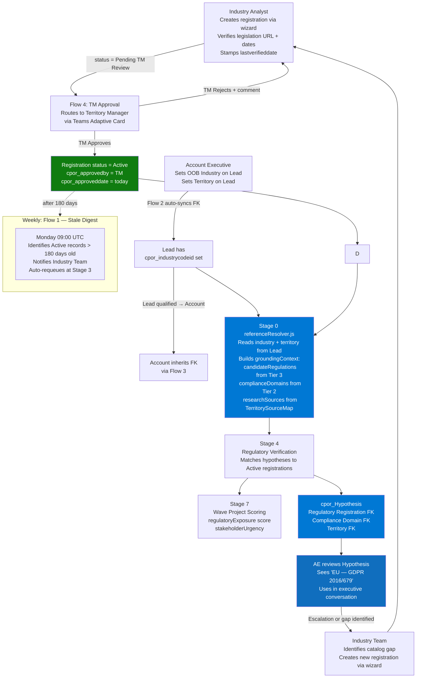

---

## Power Automate Flows

All 5 flows are stored inside the CPOR solution. Ownership is assigned to a shared automation service account (`CPOR-Automation@contoso.com`) so flow ownership persists beyond individual user tenure.

### Flow 1 — Stale Registration Weekly Digest

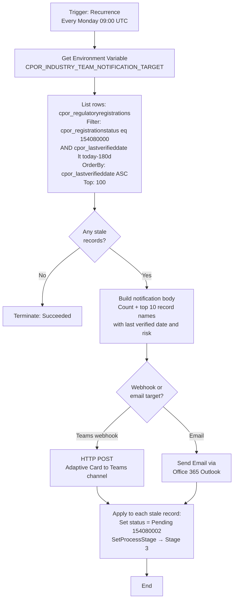

**Purpose:** Notify analysts of catalog staleness every Monday; automatically requeue stale Active records back to Stage 3 (Legislation Verification) in the BPF.

---

### Flow 2 — Lead Industry Code Auto-sync

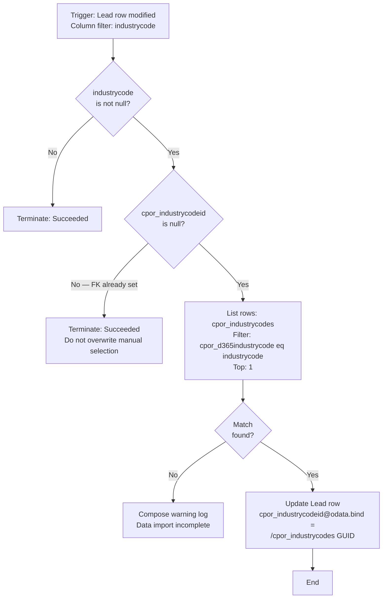

**Purpose:** Seller sets OOB Industry picklist → catalog FK auto-populated silently. No dual entry required.

---

### Flow 3 — Lead → Account Industry Code Copy on Qualification

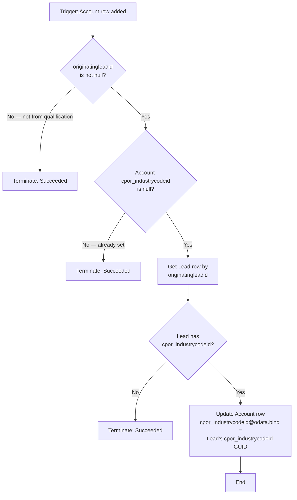

**Purpose:** Qualified Lead → new Account inherits industry classification automatically.

---

### Flow 4 — Territory Manager Approval

> **New in this architecture revision.** This flow is the trust boundary between analyst research and pipeline-active regulatory data.

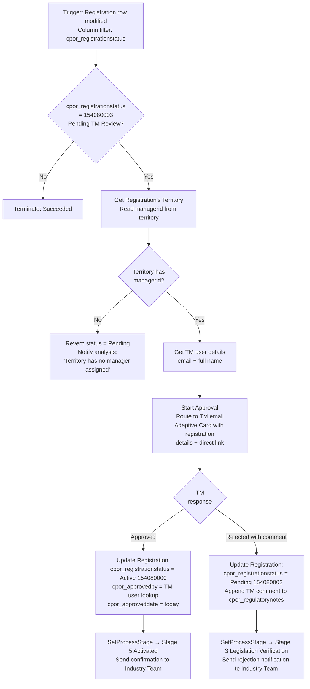

**Prerequisites:**
- Territory Manager must be assigned on the Territory record (`managerid` field)
- Flow requires **Premium connectors** (Approvals connector)
- Environment variable `CPOR_INDUSTRY_TEAM_NOTIFICATION_TARGET` must be configured

---

### Flow 5 — Territory Compliance Health Report to AE

> **New in this architecture revision.** This is the *outbound signal* that closes the loop between the Territory Manager's monitoring surface and the Account Executive's daily workspace. It fills the **ESCALATE TO AE NOW** quadrant of the Risk × Time matrix that no earlier flow addressed.

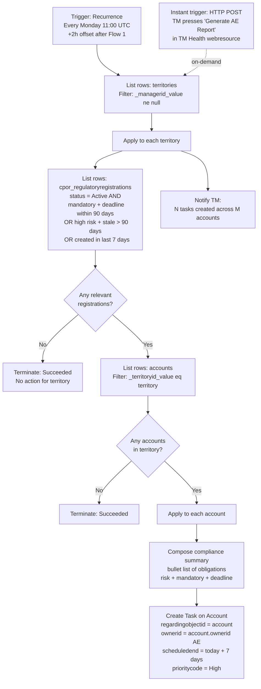

**Purpose:** Walks the OOB relationship chain `territory.managerid` (TM) → accounts in that territory (`account.territoryid`) → `account.ownerid` (AE), and drops a **Task** into each AE's Activity timeline summarising the compliance obligations that need account-team attention. The AE never has to open the CPOR Industry Catalog app — the signal comes to them in D365 Sales.

**Two run modes:**
- **Weekly automated** — Monday 11:00 UTC (offset +2h so Flow 1 stale processing finishes first).
- **On-demand** — the TM presses **Generate AE Report** on the TM Health page; an instant HTTP-triggered flow runs the same logic scoped to that TM's territories.

**Prerequisites:**
- Accounts must have `territoryid` set; territories must have `managerid` set
- No new fields required — entirely OOB relationship traversal
- Uses standard Dataverse Task creation (no Premium connector required)

### Flow Summary

| Flow | Trigger | Purpose | Premium? |
|---|---|---|---|
| CPOR — Stale Registration Weekly Digest | Scheduled Mon 09:00 UTC | Notify + requeue stale records | No |
| CPOR — Lead Industry Code Auto-sync | Lead `industrycode` modified | Populate `cpor_industrycodeid` FK | No |
| CPOR — Copy Industry Code to Account on Qualification | Account row added | Copy FK from source Lead to new Account | No |
| CPOR — Territory Manager Approval | Registration `cpor_registrationstatus` modified | Route TM sign-off; activate or reject registrations | **Yes** |
| CPOR — Territory Compliance Health Report to AE | Scheduled Mon 11:00 UTC + on-demand HTTP | Push compliance obligations to AE Task queue | No |

---

## Industry Crosswalk Reference Data

Source files in [`context/0 - Discovery/Industry Crosswalk/`](context/0%20-%20Discovery/Industry%20Crosswalk/)

### 33 D365 Industry Codes → Microsoft Industry Cloud Verticals

| Code | D365 Industry Name | Industry Cloud Vertical |
|---|---|---|
| 1 | Accounting | Financial Services |
| 2 | Agriculture and Non-petrol Natural Resource Extraction | Manufacturing and Mobility |
| 3 | Broadcasting Printing and Publishing | Media and Telecoms |
| 4 | Brokers | Financial Services |
| 5 | Building Supply Retail | Retail and Consumer Goods |
| 6 | Business Services | _(General)_ |
| 7 | Consulting | _(General)_ |
| 8 | Consumer Services | Retail and Consumer Goods |
| 9 | Design, Direction and Creative Management | Media and Telecoms |
| 10 | Distributors, Dispatchers and Processors | Manufacturing and Mobility |
| 11 | Doctor's Offices and Clinics | Healthcare and Life Sciences |
| 12 | Durable Manufacturing | Manufacturing and Mobility |
| 13 | Eating and Drinking Places | Retail and Consumer Goods |
| 14 | Entertainment Retail | Retail and Consumer Goods |
| 15 | Equipment Rental and Leasing | _(General)_ |
| 16 | Financial | Financial Services |
| 17 | Food and Tobacco Processing | Manufacturing and Mobility |
| 18 | Inbound Capital Intensive Processing | Manufacturing and Mobility |
| 19 | Inbound Repair and Services | Manufacturing and Mobility |
| 20 | Insurance | Financial Services |
| 21 | Legal Services | _(General)_ |
| 22 | Non-Durable Merchandise Retail | Retail and Consumer Goods |
| 23 | Outbound Consumer Service | Retail and Consumer Goods |
| 24 | Petrochemical Extraction and Distribution | Manufacturing and Mobility |
| 25 | Service Retail | Retail and Consumer Goods |
| 26 | SIG Affiliations | Government and Sustainability |
| 27 | Social Services | Government and Sustainability |
| 28 | Special Outbound Trade Contractors | Manufacturing and Mobility |
| 29 | Specialty Realty | _(General)_ |
| 30 | Transportation | Manufacturing and Mobility |
| 31 | Utility Creation and Distribution | Manufacturing and Mobility |
| 32 | Vehicle Retail | Retail and Consumer Goods |
| 33 | Wholesale | Retail and Consumer Goods |

### 20 Compliance Domains

| Code | Domain | Typical Regulator Types |
|---|---|---|
| CORP | Corporate registration & company law | Companies registry, commerce ministry |
| TAX | Tax, revenue & customs | Tax authority, revenue service, customs |
| LAB | Labor, employment & workplace safety | Labor ministry, OSH authority |
| PRIV | Data protection & privacy | Data protection authority, privacy commissioner |
| CYBER | Cybersecurity & digital resilience | Cybersecurity agency, sector regulator |
| FIN | Banking, securities, payments & AML | Central bank, securities commission, FIU |
| INS | Insurance | Insurance supervisor, financial regulator |
| HEALTH | Healthcare, medical products & public health | Health ministry, medical product regulator |
| FOOD | Food, beverage & agriculture | Food safety agency, agriculture ministry |
| ENV | Environment, climate & natural resources | Environmental protection agency |
| ENERGY | Energy & utilities | Energy ministry, utility regulator |
| TELCO | Telecommunications, media & broadcasting | Telecom/media regulator |
| TRAN | Transportation & logistics | Transport ministry, aviation/maritime/rail |
| CONS | Consumer protection, advertising & product safety | Consumer protection authority |
| COMP | Competition / antitrust | Competition authority, antitrust agency |
| TRADE | Trade, sanctions & export controls | Trade ministry, customs, sanctions office |
| EDU | Education & social services | Education ministry, charity regulator |
| REAL | Real estate, construction & zoning | Land registry, building authority |
| PROF | Professional services licensing | Bar association, accountancy board |
| PROC | Government procurement & grants | Procurement authority, treasury |

### Territory Hierarchy (UN M49)

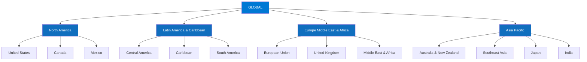

---

## Integration Points

> For IT stakeholders planning D365 Sales integration and pipeline connectivity.

### Dataverse API — Key Queries

```
# Entity record counts — run after GII 07 data import
GET /cpor_industrycodes?$count=true&$top=0          → expect 33
GET /cpor_compliancedomains?$count=true&$top=0      → expect 20
GET /cpor_regulatorysources?$count=true&$top=0      → expect 24+
GET /cpor_industrydomainmaps?$count=true&$top=0     → expect 150+
GET /cpor_territorysourcemaps?$count=true&$top=0    → expect 60+

# Active registrations only (what Stage 0 reads)
GET /cpor_regulatoryregistrations
  ?$filter=cpor_registrationstatus eq 154080000
  &$expand=cpor_IndustryCode($select=cpor_name,cpor_industrycloudvertical),
           cpor_Territory($select=name,cpor_territorycode),
           cpor_ComplianceDomain($select=cpor_name,cpor_domaincode),
           cpor_RegulatorySource($select=cpor_name,cpor_url)
  &$top=50

# Freshness check — records stale >180 days
GET /cpor_regulatoryregistrations
  ?$filter=cpor_registrationstatus eq 154080000
  and cpor_lastverifieddate lt [today-180]
  &$count=true&$top=0
  → target: 0

# FK expansion spot check
GET /cpor_industrydomainmaps
  ?$expand=cpor_IndustryCode($select=cpor_name),
           cpor_ComplianceDomain($select=cpor_name,cpor_domaincode)
  &$top=5
  → expect: both expanded names populated (not GUIDs)
```

### Lookup Binding Format (Xrm.WebApi / OData)

When creating or updating records programmatically, use the **navigation property name** (CamelCase) not the FK attribute logical name:

| Entity | Navigation property | Entity set |
|---|---|---|
| Industry Code | `cpor_IndustryCode@odata.bind` | `/cpor_industrycodes(GUID)` |
| Territory | `cpor_Territory@odata.bind` | `/territories(GUID)` |
| Compliance Domain | `cpor_ComplianceDomain@odata.bind` | `/cpor_compliancedomains(GUID)` |
| Regulatory Source | `cpor_RegulatorySource@odata.bind` | `/cpor_regulatorysources(GUID)` |

### Alternate Keys

Prefer alternate keys over GUIDs for import/upsert operations:

| Entity | Alternate key | Example |
|---|---|---|
| `cpor_IndustryCode` | `cpor_d365industrycode` | `/cpor_industrycodes(cpor_d365industrycode=16)` |
| `cpor_ComplianceDomain` | `cpor_domaincode` | `/cpor_compliancedomains(cpor_domaincode='PRIV')` |
| `territory` | `cpor_territorycode` | `/territories(cpor_territorycode='EMEA-EU')` |

### BPF — `IsBusinessProcessEnabled` Prerequisite

The Registration Qualification Business Process Flow requires the `cpor_RegulatoryRegistration` entity to have `IsBusinessProcessEnabled = true`. Enable this on the entity before creating the BPF in Power Automate / App Designer.

---

## Security Model

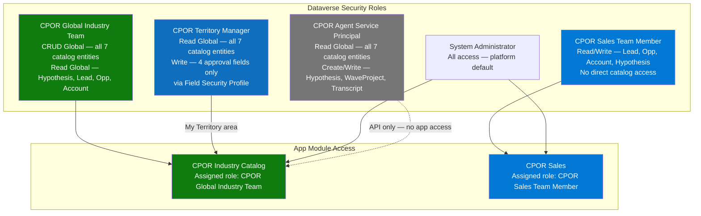

**Key principle:** Sales Team Members read catalog data _through FK expansion on forms they already have access to_ — they do not need, and are not granted, direct access to the catalog entities or the CPOR Industry Catalog app.

**Three Industry Team sub-roles** (all under `CPOR Global Industry Team`):

| Sub-Role | Primary activity |
|---|---|
| Compliance Analyst | Curate registrations; stamp `cpor_lastverifieddate`; advance BPF through Stage 3 |
| Industry Specialist | Maintain `cpor_IndustryDomainMap`; map industry codes to Cloud Verticals |
| Data Steward | Run CSV imports; manage `cpor_TerritorySourceMap` and `cpor_RegulatorySource` |

### CPOR Territory Manager role + Field Security Profile

The **CPOR Territory Manager** role (GII Guide 08) gives the TM **Global Read** on all catalog entities and **Global Read** on Lead / Opportunity / Account for business context. Row-level scoping to the TM's own territories is enforced at the **view and webresource layer** (soft-scope, Phase 1), not at the Dataverse privilege layer.

Write is intentionally Global at the role level but clamped to exactly **four fields** by the **`CPOR TM Write Fields` Field Security Profile** — because standard Dataverse roles cannot restrict Write to specific columns:

| Field (TM may update) | Type |
|---|---|
| `cpor_approvedby` | Lookup → `systemuser` |
| `cpor_approveddate` | Date Only |
| `cpor_regulatorynotes` | TextArea |
| `cpor_registrationstatus` | Choice |

The TM **cannot** write `cpor_riskrating`, `cpor_ismandatory`, the taxonomy anchors (`cpor_industrycode`, `cpor_compliancedomain`, `cpor_territory`), or `cpor_legislationurl` — risk and classification remain analyst responsibilities. The TM's job is jurisdictional sign-off, not regulatory classification.

> **Phase 2 upgrade path:** replace UI soft-scope with **Owner Teams per Territory** and switch the TM Write privilege from Global to Business Unit scope for true row-level security.

---

## Implementation Roadmap

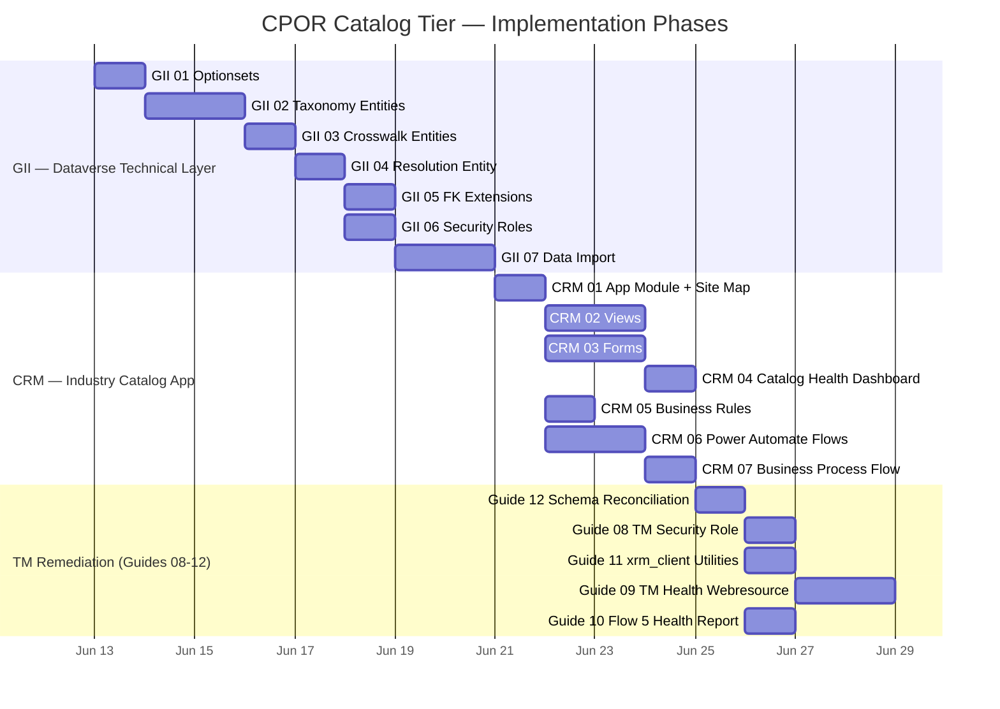

### Phase Dependency Map

```mermaid
flowchart TD
    subgraph GII["Global Industry Implementation (Technical Prerequisite)"]
        G1[GII 01\nOptionsets] --> G2[GII 02\nTaxonomy Entities]
        G2 --> G3[GII 03\nCrosswalk Entities]
        G3 --> G4[GII 04\nResolution Entity]
        G4 --> G5[GII 05\nFK Extensions]
        G4 --> G6[GII 06\nSecurity Roles]
        G5 --> G7[GII 07\nData Import]
        G6 --> G7
    end

    subgraph CRM["Industry CRM Implementation"]
        G7 --> C1[CRM 01\nApp Module + Site Map]
        C1 --> C2[CRM 02\nViews]
        C1 --> C3[CRM 03\nForms]
        C2 --> C4[CRM 04\nDashboard]
        C1 --> C5[CRM 05\nBusiness Rules]
        C1 --> C6[CRM 06\nPower Automate Flows]
        C6 --> C7[CRM 07\nBusiness Process Flow\nRequires IsBusinessProcessEnabled]
    end

    subgraph TMG["Territory Manager Remediation"]
        C7 --> T12[Guide 12\nSchema Reconciliation\nBLOCKING]
        T12 --> T08[Guide 08\nTM Security Role]
        T12 --> T11[Guide 11\nxrm_client Utilities]
        T08 --> T09[Guide 09\nTM Health Webresource]
        T11 --> T09
        T12 --> T10[Guide 10\nFlow 5 -> AE]
    end

    style G7 fill:#107c10,color:#fff
    style C1 fill:#0078d4,color:#fff
    style C7 fill:#106ebe,color:#fff
    style T12 fill:#d83b01,color:#fff
    style T09 fill:#106ebe,color:#fff
```

---

## Implementation Guides Index

### Global Industry Implementation (GII) — Dataverse Technical Layer

Location: [`context/2 - Design/Global Industry Implementation/`](context/2%20-%20Design/Global%20Industry%20Implementation/)

<details>
<summary><strong>GII Guide 00 — Overview and Design Decisions</strong></summary>

**Purpose:** Extend CPOR D365 Sales with a Global Industry Catalog tier that replaces LLM free-text recall with FK-grounded regulatory claims.

**9 Locked Design Decisions:**

1. OOB territory entity **extended** (not replaced) — 5 custom fields added
2. Lead scoped to **one territory per engagement** — one Lead per jurisdiction
3. Parent account mapping is **out of scope** — standard D365 account hierarchy
4. `cpor_territorycode` is the **alternate key** on territory (string, not GUID)
5. `cpor_domaincode` is the **alternate key** on `cpor_ComplianceDomain`
6. Catalog entities use **UserOwned ownership**
7. **180-day freshness gate** — stale records excluded from Stage 0
8. Free-text `industry` and `geography` fields **removed from pipeline intake**
9. Stage 7 runs **after** Stage 6 (S6‖S7 parallel bug fixed)

</details>

<details>
<summary><strong>GII Guide 01 — Optionsets (7 global Choices)</strong></summary>

| Schema Name | Display Name | Values |
|---|---|---|
| `cpor_industrycloudvertical` | Industry Cloud Vertical | Financial Services, Healthcare and Life Sciences, Manufacturing and Mobility, Retail and Consumer Goods, Government and Sustainability, Media and Telecoms |
| `cpor_territorytype` | Territory Type | Global, Region, Subregion, Supranational, Country |
| `cpor_jurisdictionlevel` | Jurisdiction Level | Global, Supranational, National, Subnational, Sectoral |
| `cpor_implementationpriority` | Implementation Priority | High, Medium, Low |
| `cpor_riskrating` | Risk Rating | High, Medium, Low |
| `cpor_legaltype` | Legal Type | Act, Regulation, Directive, Standard, Guidance, Framework |
| `cpor_regulatortype` | Regulator Type | Supranational Agency, National Authority, Regional Authority, Standards Body, Industry Body (SRO), Legislative Body, Other |
| `cpor_registrationstatus` | Registration Status | Active (154080000), Superseded (154080001), Pending (154080002), Pending TM Review (154080003) |

</details>

<details>
<summary><strong>GII Guides 02–04 — Entities</strong></summary>

**Taxonomy (Tier 1):**

- `cpor_IndustryCode` — 33 records, alternate key `cpor_d365industrycode`
- `cpor_ComplianceDomain` — 20 records, alternate key `cpor_domaincode`
- `territory` (OOB extended) — 34 CPOR hierarchy nodes + existing sales territories
- `cpor_RegulatorySource` — authoritative regulatory body URL registry

**Crosswalk (Tier 2):**

- `cpor_IndustryDomainMap` — N:1 to IndustryCode, N:1 to ComplianceDomain
- `cpor_TerritorySourceMap` — N:1 to territory, N:1 to ComplianceDomain, N:1 to RegulatorySource

**Resolution (Tier 3):**

- `cpor_RegulatoryRegistration` — core grounding record; FK to all 3 taxonomy entities; includes risk rating, legal type, dates, legislation URL, applicability rule, TM approval fields (`cpor_approvedby`, `cpor_approveddate`, `cpor_regulatorynotes`)

</details>

<details>
<summary><strong>GII Guide 05 — FK Extensions (5 new lookup fields)</strong></summary>

| Entity | New Field | Points To |
|---|---|---|
| `cpor_Hypothesis` | `cpor_regulatoryregistrationid` | `cpor_RegulatoryRegistration` |
| `cpor_Hypothesis` | `cpor_compliancedomainid` | `cpor_ComplianceDomain` |
| `cpor_Hypothesis` | `cpor_territoryid` | `territory` (OOB) |
| `lead` | `cpor_industrycodeid` | `cpor_IndustryCode` |
| `account` | `cpor_industrycodeid` | `cpor_IndustryCode` |

**Fallback pattern:** Stage 0 reads `cpor_industrycodeid` first; if null, resolves via `cpor_industrycodes(cpor_d365industrycode={industrycode})` — backward compatible with existing seller workflow.

</details>

<details>
<summary><strong>GII Guide 06 — Security Roles</strong></summary>

| Role | Entity Access | Scope |
|---|---|---|
| **CPOR Global Industry Team** (NEW) | CRUD on all 7 catalog entities | Global |
| **CPOR Global Industry Team** | Read-only on Hypothesis, WaveProject, Lead, Opportunity, Account | Global |
| **CPOR Agent Service Principal** (UPDATED) | Read on all 7 catalog entities + Append/AppendTo | Global |
| **CPOR Sales Team Member** | No changes — reads catalog data via FK expansion on existing forms | — |

</details>

<details>
<summary><strong>GII Guide 07 — Data Import (7 CSV files, strict order)</strong></summary>

| Step | Source CSV | Target Entity | Expected Rows |
|---|---|---|---|
| 1 | `Industry Codes.csv` | `cpor_industrycodes` | 33 |
| 2 | `Compliance Domains.csv` | `cpor_compliancedomains` | 20 |
| 3 (Pass 1) | `Territory.csv` | `territories` (no parent) | 34 |
| 4 (Pass 2) | `Territory.csv` | `territories` (set hierarchy) | 34 upsert |
| 5 | `Compliance Registry.csv` | `cpor_regulatorysources` | 24+ |
| 6 | `Industry Domain Matrix.csv` | `cpor_industrydomainmaps` | many |
| 7 | `Territory Source Matrix.csv` | `cpor_territorysourcemaps` | many |
| 8 | `Industry Import Template.csv` | `cpor_regulatoryregistrations` | 4 seed rows |

</details>

---

### Industry CRM Implementation (CRM) — Industry Catalog App

Location: [`context/2 - Design/Industry CRM Implementation/`](context/2%20-%20Design/Industry%20CRM%20Implementation/)

<details>
<summary><strong>CRM Guide 00 — Overview and Decisions</strong></summary>

**7 Locked Design Decisions:**

| # | Decision |
|---|---|
| 1 | **Dedicated App Module** — "CPOR Industry Catalog" (not a shared area in CPOR Sales) |
| 2 | **Security role gate** — only `CPOR Global Industry Team` assigned to the app |
| 3 | **Territory filter** — all territory views filter `cpor_territorycode ne null` to exclude OOB sales territories |
| 4 | **`cpor_registrationstatus` is an optionset** — integer values (154080000–154080003); all views and flows use integer comparisons |
| 5 | **Inline date edit** on Stale view — `cpor_lastverifieddate` editable in-grid via Editable Grid control |
| 6 | **Flow recipient is an Environment Variable** — `CPOR_INDUSTRY_TEAM_NOTIFICATION_TARGET` set by deploying admin |
| 7 | **TM Approval is a hard gate** — no record can become Active without Territory Manager sign-off via Flow 4 |

</details>

<details>
<summary><strong>CRM Guide 01 — App Module and Site Map</strong></summary>

**App properties:**

| Field | Value |
|---|---|
| Name | CPOR Industry Catalog |
| Unique Name | `cpor_CPORIndustryCatalog` |
| Assigned Role | CPOR Global Industry Team (only) |
| Default landing page | `cpor_catalog_health.html` web resource |

</details>

<details>
<summary><strong>CRM Guide 02 — Views (19 views across 7 entities)</strong></summary>

**`cpor_RegulatoryRegistration` — 6 views:**

| View | Filter | Sort | Default? |
|---|---|---|---|
| Active Registrations | `cpor_registrationstatus = 154080000` | `cpor_lastverifieddate` ASC | ✅ |
| Stale — Needs Reverification | `cpor_registrationstatus = Active` AND `cpor_lastverifieddate < today-180d` | `cpor_lastverifieddate` ASC | — |
| Approaching Compliance Deadlines | `cpor_registrationstatus = Active` AND `cpor_compliancedeadline < today+90d` | `cpor_compliancedeadline` ASC | — |
| High Risk — Active | `cpor_registrationstatus = Active` AND `cpor_riskrating = High` | `cpor_compliancedeadline` ASC | — |
| By Industry Vertical | `cpor_registrationstatus = Active` | `cpor_industrycloudvertical` ASC | — |
| Superseded and Pending | `cpor_registrationstatus ≠ Active` | `cpor_registrationstatus` ASC | — |

**Inline edit:** `cpor_lastverifieddate` is editable directly in the Stale view grid (Editable Grid control required at table level).

</details>

<details>
<summary><strong>CRM Guide 03 — Forms (7 form layouts)</strong></summary>

**`cpor_RegulatoryRegistration` — main form sections:**

| Section | Fields |
|---|---|
| **1 — Taxonomy Anchors** | Industry Code *, Territory *, Compliance Domain *, Regulatory Source |
| **2 — Regulator Identity** | Regulator/Body Name, Regulator Type, Regulator Website URL |
| **3 — Legislation Details** | Legal Type, Legislation Name (full), Legislation URL, Applicability Rule (multiline) |
| **4 — Risk and Status** | Risk Rating, Mandatory, Registration Status |
| **5 — Compliance Dates** | Effective Date, Compliance Deadline, **Last Verified Date** _(bold — primary operational field)_, Next Significant Date |
| **6 — Territory Manager Approval** | Approved By (`cpor_approvedby`, TM lookup), Approval Date (`cpor_approveddate`, auto-set), Stage 4 Submitted Date (`cpor_stage4submitteddate`), Analyst/TM Notes (`cpor_regulatorynotes`) |

Sub-grids on form: Industry Domain Map (filtered by Industry Code), Territory Source Map (filtered by Territory), Active Registrations with same Territory+Domain (duplicate check).

</details>

<details>
<summary><strong>CRM Guide 04 — Catalog Health Dashboard (web resource)</strong></summary>

HTML/JS web resource landing page (`cpor_catalog_health.html` + `cpor_catalog_health.js`).

- Load animation: Microsoft logo fade-in → dashboard fade-in
- 4 live data panels: Active by Vertical (SVG bar chart), Stale list, Deadline list, High Risk list
- KPI summary row: Total Active · Stale count · Deadlines ≤90d · High Risk count
- All 4 queries run in parallel via `Promise.all` against OData v4 API
- Public reload API: `CporCatalogHealth.reload()`

</details>

<details>
<summary><strong>CRM Guide 05 — Business Rules (2 rules)</strong></summary>

**Rule 1: CPOR — Lock Superseded Record Fields**

- Trigger: `cpor_registrationstatus = Superseded (154080001)`
- Action: Disable all fields except `cpor_regulatorynotes` and `cpor_registrationstatus`
- Scope: All Forms

**Rule 2: CPOR — Require Compliance Deadline When Mandatory**

- Trigger: `cpor_ismandatory = Yes`
- True action: Set `cpor_compliancedeadline` → Business Required
- False action: Set `cpor_compliancedeadline` → No Constraint
- Scope: All Forms

</details>

<details>
<summary><strong>CRM Guide 06 — Power Automate Flows (5 flows)</strong></summary>

See [Power Automate Flows](#power-automate-flows) section above for full flow diagrams.

All flows assigned to shared service account. Flow 4 (TM Approval) requires Premium Approvals connector. Flow 5 (Health Report to AE) uses standard Dataverse Task creation — no Premium connector required.

Environment variables required:
- `CPOR_INDUSTRY_TEAM_NOTIFICATION_TARGET` — Teams webhook URL or email address for stale digest (Flow 1) and approval notifications (Flow 4)

</details>

<details>
<summary><strong>CRM Guide 07 — Business Process Flow: Registration Qualification</strong></summary>

**BPF name:** CPOR — Registration Qualification  
**Entity:** `cpor_RegulatoryRegistration`  
**Prerequisite:** `IsBusinessProcessEnabled = true` on entity before creating BPF

5 stages — see [5-Stage Registration Qualification Flow](#5-stage-registration-qualification-flow) above for full detail.

Key BPF integration points with Power Automate:
- Flow 1 (Stale Digest) calls `SetProcessStage` → Stage 3 on requeued records
- Flow 4 (TM Approval) calls `SetProcessStage` → Stage 5 on approval, Stage 3 on rejection

</details>

---

### Territory Manager Remediation (Guides 08–12)

These guides extend the design from an approval-gated catalog into a **monitoring-capable** one for the Territory Manager. Guide 12 is **blocking** — it reconciles the schema naming conflicts (`cpor_verifiedby` → `cpor_approvedby`, `cpor_approvaldate` → `cpor_approveddate`) that would otherwise cause runtime failures.

```mermaid
flowchart LR
    G12[Guide 12\nSchema Reconciliation\nBLOCKING] --> G08[Guide 08\nTM Security Role\n+ Field Security Profile]
    G12 --> G11[Guide 11\nxrm_client.js\ngetCurrentUserId]
    G08 --> G09[Guide 09\nTM Health\nWebresource]
    G11 --> G09
    G12 --> G10[Guide 10\nFlow 5 → AE]
    style G12 fill:#d83b01,color:#fff
    style G09 fill:#0078d4,color:#fff
    style G10 fill:#106ebe,color:#fff
```

<details>
<summary><strong>Guide 08 — CPOR Territory Manager Security Role</strong></summary>

Defines the `CPOR Territory Manager` role (Global Read on all catalog + engagement entities), the `CPOR TM Write Fields` Field Security Profile (Write on `cpor_approvedby`, `cpor_approveddate`, `cpor_regulatorynotes`, `cpor_registrationstatus` only), the **My Territory** site map area, and two scoped views — **Pending My Approval** and **Approved by Me**. Soft-scope (UI filtering) in Phase 1; Owner Teams in Phase 2.

</details>

<details>
<summary><strong>Guide 09 — TM Territory Health Webresource</strong></summary>

`cpor_tm_health.html` / `cpor_tm_health.js` — a territory-scoped parallel to the Catalog Health dashboard. KPI tiles (My Territories, Active, Pending My Approval, Critical), per-territory breakdown, and three tabs: **Pending My Approval** (Days Pending = today − `cpor_stage4submitteddate`), **Approaching Deadlines**, **Stale in My Territories**. Hosts the **Generate AE Report** button that fires Flow 5 on demand.

</details>

<details>
<summary><strong>Guide 10 — Flow 5: Territory Compliance Health Report to AE</strong></summary>

The outbound signal flow documented in [Flow 5](#flow-5--territory-compliance-health-report-to-ae) above. Weekly (Mon 11:00 UTC) + on-demand; creates compliance Tasks on Accounts owned by the AE, walking `territory.managerid` → `account.territoryid` → `account.ownerid`.

</details>

<details>
<summary><strong>Guide 11 — cpor_xrm_client.js: TM Identity & Territory Utilities</strong></summary>

Adds `getCurrentUserId()` (`Xrm.Utility.getGlobalContext().getUserId()`, curly braces stripped), `getManagedTerritoryIds()`, and the OR-chain `buildTerritoryFilter()` helper — required because the Dataverse Web API has no `$in` operator on lookups. These power the territory scoping used by both the TM Health page and the Sales Research Agents.

</details>

<details>
<summary><strong>Guide 12 — Schema Reconciliation and Corrections (BLOCKING)</strong></summary>

The authoritative correction guide. Confirms the deployed logical names are **`cpor_approvedby`** and **`cpor_approveddate`** (not `cpor_verifiedby` / `cpor_approvaldate`), corrects every Flow 4 / BPF / form reference, fixes `cpor_additionalsources`, and specifies the new **`cpor_stage4submitteddate`** (Date Only) field that Flow 4 stamps on entry to Stage 4 for SLA tracking. Must be completed before deploying Guides 06, 08–11.

</details>

---

## User Experience Architecture

```mermaid
graph LR
    subgraph IT["Global Industry Team\n(CPOR Global Industry Team role)"]
        CA[Compliance Analyst\nPrimary: RegulatoryRegistration\nWizard entry · BPF stages 1-3]
        IS[Industry Specialist\nPrimary: IndustryDomainMap\nVertical mapping]
        DS[Data Steward\nPrimary: CSV imports\nTerritorySourceMap · Sources]
    end

    subgraph TM["Territory Managers\n(CPOR Territory Manager role)"]
        TMR[Territory Manager\nMy Territory area + TM Health page\nApprove/reject via Flow 4\nSales Research Agents Q&A]
    end

    subgraph ST["Sales Team\n(CPOR Sales Team Member role)"]
        SE[Seller\nLeads · Opportunities\nIndustry Code + Territory set on Lead]
        AM[Account Manager\nAccounts · Hypothesis review\nRegulatory Grounding section\nFlow 5 compliance Tasks]
    end

    subgraph APPS["Model Driven Apps"]
        ICA[CPOR Industry Catalog App\nIndustry Team + TM My Territory area\nLanding: Catalog Health Dashboard]
        CSA[CPOR Sales App\nSellers + Account Managers]
    end

    CA --> ICA
    IS --> ICA
    DS --> ICA
    TMR -->|My Territory + agents| ICA
    TMR -.->|Flow 5 Tasks| AM
    SE --> CSA
    AM --> CSA

    ICA -->|curates catalog| CATALOG[(Dataverse\nCatalog Tier)]
    CSA -->|reads FK expansion| CATALOG
    PIPELINE[AI Pipeline\nStage 0] -->|queries catalog| CATALOG
    PIPELINE -->|writes FK to Hypothesis| CSA
```

---

## Verification Reference

### Post-Deployment Acceptance Checklist

| # | Check | Expected |
|---|---|---|
| 1 | Log in as CPOR Global Industry Team member | Can access CPOR Industry Catalog; cannot access CPOR Sales |
| 2 | Open app — Catalog Health dashboard loads | Microsoft logo fades in, then 4-panel dashboard renders with live data |
| 3 | Navigate Taxonomy > Industry Codes | 33 rows visible |
| 4 | Navigate Registrations; open Active Registrations view | Default view loads; columns show expanded FK names |
| 5 | Open a RegulatoryRegistration record | 6 sections visible; BPF stage bar visible at top |
| 6 | Set `cpor_registrationstatus = Superseded` on a test record | All fields except Analyst Notes and Status lock (Business Rule 1) |
| 7 | Set `cpor_ismandatory = Yes` on a test record | Compliance Deadline shows required indicator (Business Rule 2) |
| 8 | Create registration via wizard; advance to Stage 3; set status = Pending TM Review | Flow 4 triggers; TM receives Teams/email approval request within 5 minutes |
| 9 | TM approves via Teams card | Registration status = Active; `cpor_approvedby` and `cpor_approveddate` populated; BPF at Stage 5 |
| 10 | TM rejects via Teams card | Registration status = Pending; TM comment appended to `cpor_regulatorynotes`; BPF returns to Stage 3 |
| 11 | Set Lead `industrycode` = Financial and save | After 60 sec: `cpor_industrycodeid` populated (Flow 2) |
| 12 | Qualify Lead to Account | After 60 sec: Account `cpor_industrycodeid` matches Lead (Flow 3) |
| 13 | Run Flow 1 manually with a stale test record | Notification received at `CPOR_INDUSTRY_TEAM_NOTIFICATION_TARGET`; stale record status set to Pending; BPF at Stage 3 |
| 14 | OData count verification | `GET /cpor_regulatoryregistrations?$filter=cpor_registrationstatus eq 154080000` returns only TM-approved records |
| 15 | Log in as CPOR Territory Manager; open My Territory > TM Health | Page loads territory-scoped KPIs; non-approval fields are read-only (Field Security Profile) |
| 16 | Run Flow 5 with a mandatory registration due within 90 days | Task created on each Account in the territory, owned by the Account's AE, due in 7 days |
| 17 | Ask a Sales Research Agent "What's in my approval queue and what's overdue?" | Agent returns Pending TM Review records scoped to the TM's territories, flagging items past the 7-day SLA |

### Quick Health Check (OData)

```
GET /cpor_industrycodes?$count=true&$top=0          → expect 33
GET /cpor_compliancedomains?$count=true&$top=0      → expect 20
GET /cpor_regulatorysources?$count=true&$top=0      → expect 24+
GET /cpor_industrydomainmaps?$count=true&$top=0     → expect 150+
GET /cpor_territorysourcemaps?$count=true&$top=0    → expect 60+
```

---

## File Index

```
CPOR Industry Engagement/
├── README.md                                           ← this file
├── context/
│   ├── 0 - Discovery/
│   │   ├── microsoft_sales_industry_analysis_discussion.txt
│   │   ├── d365_regulatory_compliance_design_discussion.md
│   │   └── Industry Crosswalk/
│   │       ├── Industry Analysis ReadMe.txt
│   │       ├── Industry Codes.csv                      33 D365 industry codes
│   │       ├── Compliance Domains.csv                  20 compliance domain codes
│   │       ├── Territory.csv                           34 UN M49 hierarchy nodes
│   │       ├── Compliance Registry.csv                 24+ regulatory sources
│   │       ├── Industry Domain Matrix.csv              industry × domain crosswalk
│   │       ├── Territory Source Matrix.csv             territory × domain × source
│   │       └── Industry Import Template.csv            Dataverse import template (4 seed rows)
│   └── 2 - Design/
│       ├── customizations.xml                          D365 solution export
│       ├── dataverse.api.txt                           OData v4 reference
│       ├── Global Industry Implementation/             GII Guides 00–07
│       │   ├── Implementation Guide - 00 Overview.txt
│       │   ├── Implementation Guide - 01 Optionsets.txt
│       │   ├── Implementation Guide - 02 Taxonomy Entities.txt
│       │   ├── Implementation Guide - 03 Crosswalk Entities.txt
│       │   ├── Implementation Guide - 04 Resolution Entity.txt
│       │   ├── Implementation Guide - 05 FK Extensions and Relationships.txt
│       │   ├── Implementation Guide - 06 Security Roles.txt
│       │   └── Implementation Guide - 07 Data Import.txt
│       └── Industry CRM Implementation/               CRM Guides 00–07
│           ├── Implementation Guide - 00 Overview.txt
│           ├── Implementation Guide - 01 App Module and Site Map.txt
│           ├── Implementation Guide - 02 Views.txt
│           ├── Implementation Guide - 03 Forms.txt
│           ├── Implementation Guide - 04 Catalog Health Dashboard.txt
│           ├── Implementation Guide - 05 Business Rules.txt
│           ├── Implementation Guide - 06 Power Automate Flows.txt
│           └── Implementation Guide - 07 Business Process Flow.txt
└── webresources/
    ├── css/
    │   └── cpor_styles.css                             Fluent UI 2 design tokens
    ├── html/
    │   ├── cpor_catalog_health.html                    Landing page dashboard shell
    │   ├── cpor_registration_manager.html              Registration list page
    │   ├── cpor_crosswalk.html                         Crosswalk explorer
    │   └── cpor_taxonomy.html                          Taxonomy browser
    ├── js/
    │   ├── cpor_xrm_client.js                          Dataverse API wrapper
    │   ├── cpor_components.js                          Shared UI components
    │   ├── cpor_catalog_health.js                      Dashboard data + rendering
    │   ├── cpor_new_registration_dialog.js             4-step registration wizard modal
    │   ├── cpor_registration_manager.js                Registration list page module
    │   ├── cpor_crosswalk.js                           Crosswalk explorer module
    │   └── cpor_taxonomy.js                            Taxonomy browser module
    └── media/
        └── Microsoft-Logo.png                          Splash logo (dashboard load animation)
```

---

_CPOR Durable · Global Industry Team · June 2026_