# CPOR Industry Engagement — Global Industry Catalog

> **CPOR Durable** · Dynamics 365 Sales · Dataverse Catalog Tier Extension + Industry CRM Layer  
> Last updated: June 2026

---

## Table of Contents

- [Project Overview](#project-overview)
- [Microsoft Sales Industry Context](#microsoft-sales-industry-context)
- [Solution Architecture](#solution-architecture)
- [Data Model](#data-model)
- [Industry Crosswalk Reference Data](#industry-crosswalk-reference-data)
- [Implementation Roadmap](#implementation-roadmap)
- [Global Industry Implementation — GII Guides 00–07](#global-industry-implementation--gii-guides-0007)
- [Industry CRM Implementation — CRM Guides 00–06](#industry-crm-implementation--crm-guides-0006)
- [User Experience Architecture](#user-experience-architecture)
- [Cross-Team Workflow](#cross-team-workflow)
- [Power Automate Flows](#power-automate-flows)
- [Security Model](#security-model)
- [Verification Reference](#verification-reference)

---

## Project Overview

The CPOR Industry Engagement project extends the deployed **CPOR Dynamics 365 Sales** solution with a two-layer capability:

| Layer                            | Purpose                                                                                                                                                                   |
| -------------------------------- | ------------------------------------------------------------------------------------------------------------------------------------------------------------------------- |
| **Dataverse Catalog Tier** (GII) | Provides authoritative reference data: industry codes, compliance domains, territory hierarchy, regulatory sources, crosswalk maps, and verified regulatory registrations |
| **Industry CRM Layer** (CRM)     | Delivers a dedicated Model Driven App — _CPOR Industry Catalog_ — for the Global Industry Team to curate, manage, and health-check that catalog data                      |

**Before this extension:** Every regulatory claim generated by the CPOR pipeline was free-text recalled from LLM model training — inconsistent, hallucination-prone, and untraceable in Dataverse.

**After this extension:** Each Regulatory hypothesis carries a foreign key to a `cpor_RegulatoryRegistration` record naming the specific law, regulator, URL, risk rating, and compliance deadline — verified by a human analyst.

---

## Microsoft Sales Industry Context

<details>
<summary><strong>Microsoft Sales Analysis — Key Takeaways (expand)</strong></summary>

### Revenue Context

Microsoft reported **$82.9B revenue in FY26 Q3** (+18% YoY), with FY2025 annual revenue of **$281.7B** and Microsoft Cloud revenue of **$168.9B** (+23%).

### Primary Demand Drivers

| Driver                      | CPOR Relevance                                           |
| --------------------------- | -------------------------------------------------------- |
| AI adoption                 | Pipeline hypothesis generation; Copilot readiness scores |
| Security consolidation      | Compliance domain mapping (CYBER, PRIV, FIN)             |
| Cloud migration             | Azure modernization hypotheses                           |
| Data governance             | Regulatory grounding of sales claims                     |
| Industry-specific solutions | Industry Cloud Vertical alignment per account            |

### Microsoft's Industry Research Methodology

Microsoft's MCAPS industry research follows a repeatable lifecycle:

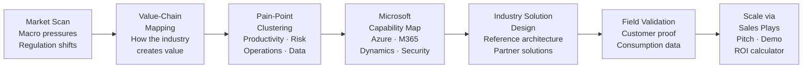

### Research-to-Revenue Formula

> **Industry insight + business outcome + Microsoft platform + partner specialization + proof of value = scalable sales motion**

</details>

---

## Solution Architecture

The catalog is organized in three tiers. The AI pipeline (Stage 0 `referenceResolver.js`) queries down through all three tiers to build the `groundingContext` object passed to all subsequent stages.

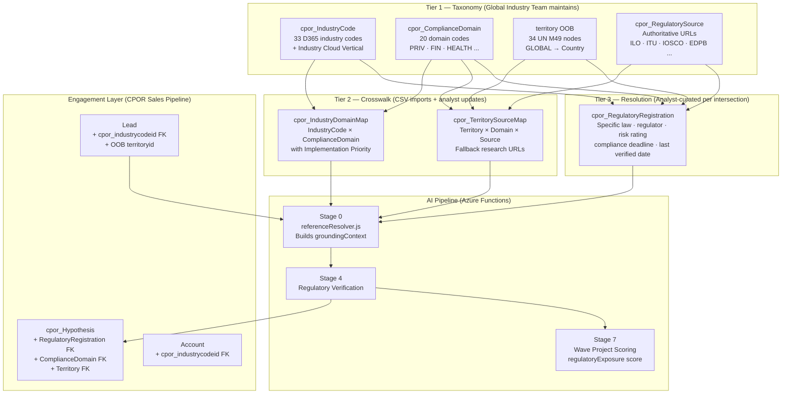

### 180-Day Freshness Gate

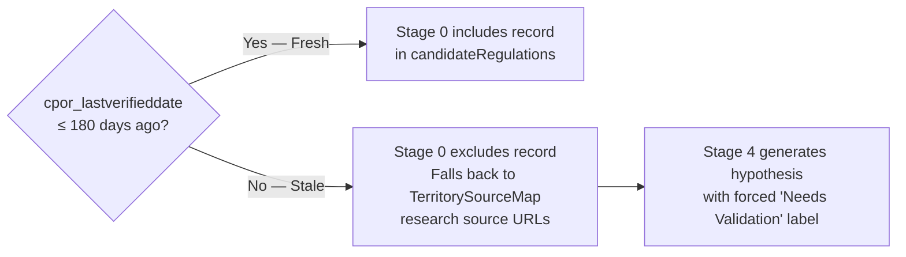

---

## Data Model

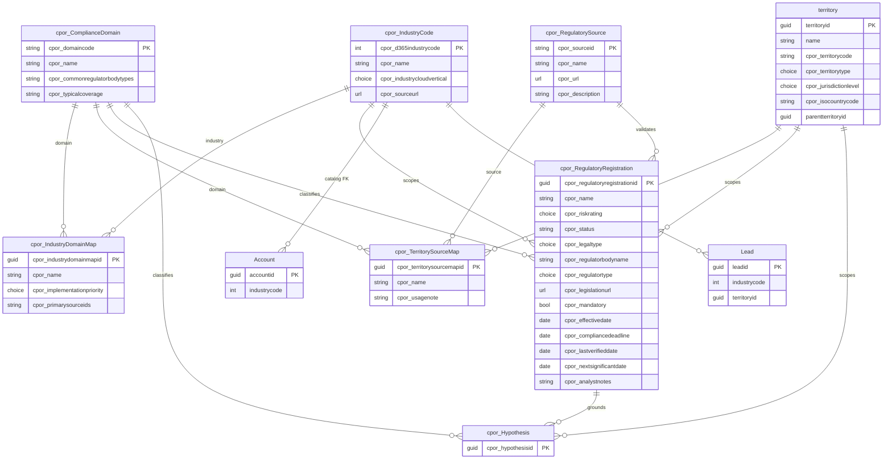

---

## Industry Crosswalk Reference Data

Source files in [`context/0 - Discovery/Industry Crosswalk/`](context/0%20-%20Discovery/Industry%20Crosswalk/)

### 33 D365 Industry Codes → Microsoft Industry Cloud Verticals

| Code | D365 Industry Name                                     | Industry Cloud Vertical       |
| ---- | ------------------------------------------------------ | ----------------------------- |
| 1    | Accounting                                             | Financial Services            |
| 2    | Agriculture and Non-petrol Natural Resource Extraction | Manufacturing and Mobility    |
| 3    | Broadcasting Printing and Publishing                   | Media and Telecoms            |
| 4    | Brokers                                                | Financial Services            |
| 5    | Building Supply Retail                                 | Retail and Consumer Goods     |
| 6    | Business Services                                      | _(General)_                   |
| 7    | Consulting                                             | _(General)_                   |
| 8    | Consumer Services                                      | Retail and Consumer Goods     |
| 9    | Design, Direction and Creative Management              | Media and Telecoms            |
| 10   | Distributors, Dispatchers and Processors               | Manufacturing and Mobility    |
| 11   | Doctor's Offices and Clinics                           | Healthcare and Life Sciences  |
| 12   | Durable Manufacturing                                  | Manufacturing and Mobility    |
| 13   | Eating and Drinking Places                             | Retail and Consumer Goods     |
| 14   | Entertainment Retail                                   | Retail and Consumer Goods     |
| 15   | Equipment Rental and Leasing                           | _(General)_                   |
| 16   | Financial                                              | Financial Services            |
| 17   | Food and Tobacco Processing                            | Manufacturing and Mobility    |
| 18   | Inbound Capital Intensive Processing                   | Manufacturing and Mobility    |
| 19   | Inbound Repair and Services                            | Manufacturing and Mobility    |
| 20   | Insurance                                              | Financial Services            |
| 21   | Legal Services                                         | _(General)_                   |
| 22   | Non-Durable Merchandise Retail                         | Retail and Consumer Goods     |
| 23   | Outbound Consumer Service                              | Retail and Consumer Goods     |
| 24   | Petrochemical Extraction and Distribution              | Manufacturing and Mobility    |
| 25   | Service Retail                                         | Retail and Consumer Goods     |
| 26   | SIG Affiliations                                       | Government and Sustainability |
| 27   | Social Services                                        | Government and Sustainability |
| 28   | Special Outbound Trade Contractors                     | Manufacturing and Mobility    |
| 29   | Specialty Realty                                       | _(General)_                   |
| 30   | Transportation                                         | Manufacturing and Mobility    |
| 31   | Utility Creation and Distribution                      | Manufacturing and Mobility    |
| 32   | Vehicle Retail                                         | Retail and Consumer Goods     |
| 33   | Wholesale                                              | Retail and Consumer Goods     |

### 20 Compliance Domains

| Code   | Domain                                            | Typical Regulator Types                         |
| ------ | ------------------------------------------------- | ----------------------------------------------- |
| CORP   | Corporate registration & company law              | Companies registry, commerce ministry           |
| TAX    | Tax, revenue & customs                            | Tax authority, revenue service, customs         |
| LAB    | Labor, employment & workplace safety              | Labor ministry, OSH authority                   |
| PRIV   | Data protection & privacy                         | Data protection authority, privacy commissioner |
| CYBER  | Cybersecurity & digital resilience                | Cybersecurity agency, sector regulator          |
| FIN    | Banking, securities, payments & AML               | Central bank, securities commission, FIU        |
| INS    | Insurance                                         | Insurance supervisor, financial regulator       |
| HEALTH | Healthcare, medical products & public health      | Health ministry, medical product regulator      |
| FOOD   | Food, beverage & agriculture                      | Food safety agency, agriculture ministry        |
| ENV    | Environment, climate & natural resources          | Environmental protection agency                 |
| ENERGY | Energy & utilities                                | Energy ministry, utility regulator              |
| TELCO  | Telecommunications, media & broadcasting          | Telecom/media regulator                         |
| TRAN   | Transportation & logistics                        | Transport ministry, aviation/maritime/rail      |
| CONS   | Consumer protection, advertising & product safety | Consumer protection authority                   |
| COMP   | Competition / antitrust                           | Competition authority, antitrust agency         |
| TRADE  | Trade, sanctions & export controls                | Trade ministry, customs, sanctions office       |
| EDU    | Education & social services                       | Education ministry, charity regulator           |
| REAL   | Real estate, construction & zoning                | Land registry, building authority               |
| PROF   | Professional services licensing                   | Bar association, accountancy board              |
| PROC   | Government procurement & grants                   | Procurement authority, treasury                 |

### Territory Hierarchy (UN M49)

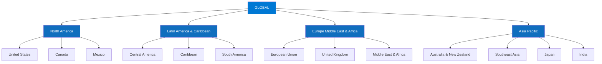

---

## Implementation Roadmap

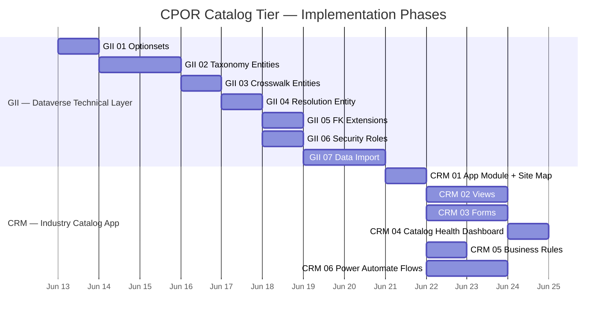

### Phase Dependency Map

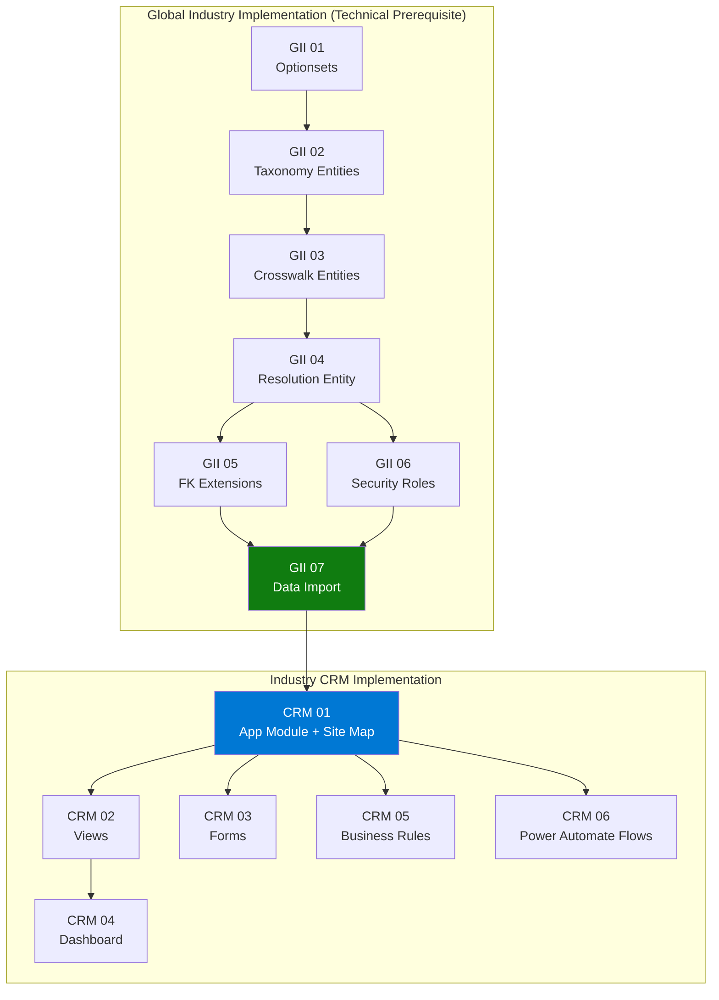

---

## Global Industry Implementation — GII Guides 00–07

Location: [`context/2 - Design/Global Industry Implementation/`](context/2%20-%20Design/Global%20Industry%20Implementation/)

<details>
<summary><strong>GII Guide 00 — Overview and Design Decisions</strong></summary>

**Purpose:** Extend CPOR D365 Sales with a Global Industry Catalog tier that replaces LLM free-text recall with FK-grounded regulatory claims.

**9 Locked Design Decisions:**

1. OOB territory entity **extended** (not replaced) — 5 custom fields added
2. Lead scoped to **one territory per engagement** — one Lead per jurisdiction
3. Parent account mapping is **out of scope** — standard D365 account hierarchy
4. `cpor_territorycode` is the **alternate key** on territory (string, not GUID)
5. `cpor_domaincode` is the **alternate key** on `cpor_ComplianceDomain`
6. Catalog entities use **UserOwned ownership**
7. **180-day freshness gate** — stale records excluded from Stage 0
8. Free-text `industry` and `geography` fields **removed from pipeline intake**
9. Stage 7 runs **after** Stage 6 (S6‖S7 parallel bug fixed)

</details>

<details>
<summary><strong>GII Guide 01 — Optionsets (7 global Choices)</strong></summary>

| Schema Name                   | Display Name            | Values                                                                                                                                                     |
| ----------------------------- | ----------------------- | ---------------------------------------------------------------------------------------------------------------------------------------------------------- |
| `cpor_industrycloudvertical`  | Industry Cloud Vertical | Financial Services, Healthcare and Life Sciences, Manufacturing and Mobility, Retail and Consumer Goods, Government and Sustainability, Media and Telecoms |
| `cpor_territorytype`          | Territory Type          | Global, Region, Subregion, Supranational, Country                                                                                                          |
| `cpor_jurisdictionlevel`      | Jurisdiction Level      | Global, Supranational, National, Subnational, Sectoral                                                                                                     |
| `cpor_implementationpriority` | Implementation Priority | High, Medium, Low                                                                                                                                          |
| `cpor_riskrating`             | Risk Rating             | High, Medium, Low                                                                                                                                          |
| `cpor_legaltype`              | Legal Type              | Act, Regulation, Directive, Standard, Guidance, Framework                                                                                                  |
| `cpor_regulatortype`          | Regulator Type          | Supranational Agency, National Authority, Regional Authority, Standards Body, Industry Body (SRO), Legislative Body, Other                                 |

</details>

<details>
<summary><strong>GII Guides 02–04 — Entities</strong></summary>

**Taxonomy (Tier 1):**

- `cpor_IndustryCode` — 33 records, alternate key `cpor_d365industrycode`
- `cpor_ComplianceDomain` — 20 records, alternate key `cpor_domaincode`
- `territory` (OOB extended) — 34 CPOR hierarchy nodes + existing sales territories
- `cpor_RegulatorySource` — authoritative regulatory body URL registry

**Crosswalk (Tier 2):**

- `cpor_IndustryDomainMap` — N:1 to IndustryCode, N:1 to ComplianceDomain
- `cpor_TerritorySourceMap` — N:1 to territory, N:1 to ComplianceDomain, N:1 to RegulatorySource

**Resolution (Tier 3):**

- `cpor_RegulatoryRegistration` — core grounding record; FK to all 3 taxonomy entities; includes risk rating, legal type, dates, legislation URL, applicability rule

</details>

<details>
<summary><strong>GII Guide 05 — FK Extensions (5 new lookup fields)</strong></summary>

| Entity            | New Field                       | Points To                     |
| ----------------- | ------------------------------- | ----------------------------- |
| `cpor_Hypothesis` | `cpor_regulatoryregistrationid` | `cpor_RegulatoryRegistration` |
| `cpor_Hypothesis` | `cpor_compliancedomainid`       | `cpor_ComplianceDomain`       |
| `cpor_Hypothesis` | `cpor_territoryid`              | `territory` (OOB)             |
| `lead`            | `cpor_industrycodeid`           | `cpor_IndustryCode`           |
| `account`         | `cpor_industrycodeid`           | `cpor_IndustryCode`           |

**Fallback pattern:** Stage 0 reads `cpor_industrycodeid` first; if null, resolves via `cpor_industrycodes(cpor_d365industrycode={industrycode})` — backward compatible with existing seller workflow.

</details>

<details>
<summary><strong>GII Guide 06 — Security Roles</strong></summary>

| Role                                       | Entity Access                                                      | Scope  |
| ------------------------------------------ | ------------------------------------------------------------------ | ------ |
| **CPOR Global Industry Team** (NEW)        | CRUD on all 7 catalog entities                                     | Global |
| **CPOR Global Industry Team**              | Read-only on Hypothesis, WaveProject, Lead, Opportunity, Account   | Global |
| **CPOR Agent Service Principal** (UPDATED) | Read on all 7 catalog entities + Append/AppendTo                   | Global |
| **CPOR Sales Team Member**                 | No changes — reads catalog data via FK expansion on existing forms | —      |

</details>

<details>
<summary><strong>GII Guide 07 — Data Import (7 CSV files, strict order)</strong></summary>

| Step       | Source CSV                     | Target Entity                  | Expected Rows |
| ---------- | ------------------------------ | ------------------------------ | ------------- |
| 1          | `Industry Codes.csv`           | `cpor_industrycodes`           | 33            |
| 2          | `Compliance Domains.csv`       | `cpor_compliancedomains`       | 20            |
| 3 (Pass 1) | `Territory.csv`                | `territories` (no parent)      | 34            |
| 4 (Pass 2) | `Territory.csv`                | `territories` (set hierarchy)  | 34 upsert     |
| 5          | `Compliance Registry.csv`      | `cpor_regulatorysources`       | 24+           |
| 6          | `Industry Domain Matrix.csv`   | `cpor_industrydomainmaps`      | many          |
| 7          | `Territory Source Matrix.csv`  | `cpor_territorysourcemaps`     | many          |
| 8          | `Industry Import Template.csv` | `cpor_regulatoryregistrations` | seed rows     |

</details>

---

## Industry CRM Implementation — CRM Guides 00–06

Location: [`context/2 - Design/Industry CRM Implementation/`](context/2%20-%20Design/Industry%20CRM%20Implementation/)

<details>
<summary><strong>CRM Guide 00 — Overview and Decisions</strong></summary>

**6 Locked Design Decisions:**

| #   | Decision                                                                                                        |
| --- | --------------------------------------------------------------------------------------------------------------- |
| 1   | **Dedicated App Module** — "CPOR Industry Catalog" (not a shared area in CPOR Sales)                            |
| 2   | **Security role gate** — only `CPOR Global Industry Team` assigned to the app                                   |
| 3   | **Territory filter** — all territory views filter `cpor_territorycode ne null` to exclude OOB sales territories |
| 4   | **`cpor_status` remains free text** in this release — views filter on "Active", "Superseded", "Pending" strings |
| 5   | **Inline date edit** on Stale view — `cpor_lastverifieddate` editable in-grid via Editable Grid control         |
| 6   | **Flow recipient is an Environment Variable** — `CPOR_INDUSTRY_TEAM_NOTIFICATION_TARGET` set by deploying admin |

**Three Industry Team Sub-Roles:**

| Sub-Role            | Primary Activity                                                                       |
| ------------------- | -------------------------------------------------------------------------------------- |
| Compliance Analyst  | Curate `cpor_RegulatoryRegistration` records; update `cpor_lastverifieddate` on review |
| Industry Specialist | Maintain `cpor_IndustryDomainMap`; map industry codes to Industry Cloud Verticals      |
| Data Steward        | Run CSV imports; manage `cpor_TerritorySourceMap` and `cpor_RegulatorySource` records  |

</details>

<details>
<summary><strong>CRM Guide 01 — App Module and Site Map</strong></summary>

**App properties:**

| Field         | Value                            |
| ------------- | -------------------------------- |
| Name          | CPOR Industry Catalog            |
| Unique Name   | `cpor_CPORIndustryCatalog`       |
| Assigned Role | CPOR Global Industry Team (only) |

**Site Map:**

```
Dashboard
  └── My Work
      └── Catalog Health  [Dashboard]

Taxonomy
  └── Reference Data
      ├── Industry Codes
      ├── Compliance Domains
      ├── Territories
      └── Regulatory Sources

Crosswalk
  └── Mapping Tables
      ├── Industry Domain Maps
      └── Territory Source Maps

Registrations
  └── Regulatory Catalog
      └── Regulatory Registrations  ← primary working entity
```

</details>

<details>
<summary><strong>CRM Guide 02 — Views (19 views across 7 entities)</strong></summary>

**`cpor_RegulatoryRegistration` — 6 views:**

| View                             | Filter                                                | Sort                                  | Default? |
| -------------------------------- | ----------------------------------------------------- | ------------------------------------- | -------- |
| Active Registrations             | `status = Active`                                     | `lastverifieddate` ASC (oldest first) | ✅       |
| Stale — Needs Reverification     | `status = Active` AND `lastverifieddate < today-180d` | `lastverifieddate` ASC                | —        |
| Approaching Compliance Deadlines | `status = Active` AND `deadline < today+90d`          | `deadline` ASC                        | —        |
| High Risk — Active               | `status = Active` AND `riskrating = High`             | `deadline` ASC                        | —        |
| By Industry Vertical             | `status = Active`                                     | `industrycloudvertical` ASC           | —        |
| Superseded and Pending           | `status ≠ Active`                                     | `status` ASC                          | —        |

**Supporting entity views:** 3 for `cpor_IndustryCode`, 2 for `cpor_ComplianceDomain`, 2 for territory (filtered), 2 for `cpor_RegulatorySource`, 3 for `cpor_IndustryDomainMap`, 2 for `cpor_TerritorySourceMap`.

**Inline edit:** `cpor_lastverifieddate` is editable directly in the Stale view grid (Editable Grid control required at table level).

</details>

<details>
<summary><strong>CRM Guide 03 — Forms (7 form layouts)</strong></summary>

**`cpor_RegulatoryRegistration` — 6-section form:**

| Section                     | Fields                                                                                                                  |
| --------------------------- | ----------------------------------------------------------------------------------------------------------------------- |
| **1 — Taxonomy Anchors**    | Industry Code _, Territory _, Compliance Domain \*, Regulatory Source                                                   |
| **2 — Regulator Identity**  | Regulator/Body Name, Regulator Type, Regulator Website URL                                                              |
| **3 — Legislation Details** | Legal Type, Legislation Name (full), Legislation URL, Applicability Rule (multiline)                                    |
| **4 — Risk and Status**     | Risk Rating, Mandatory, Status (with guidance note on free-text values)                                                 |
| **5 — Compliance Dates**    | Effective Date, Compliance Deadline, **Last Verified Date** _(bold — primary operational field)_, Next Significant Date |
| **6 — Analyst Notes**       | `cpor_analystnotes` (2000 chars — stays editable on Superseded records)                                                 |

**New field required before Guide 03:** Add `cpor_analystnotes` (Text Area 2000) to `cpor_RegulatoryRegistration` — not in GII Guide 04.

Supporting forms defined for: `cpor_IndustryDomainMap`, `cpor_TerritorySourceMap`, territory OOB (CPOR extensions section appended at bottom), `cpor_RegulatorySource`, `cpor_IndustryCode`, `cpor_ComplianceDomain`.

</details>

<details>
<summary><strong>CRM Guide 04 — Catalog Health Dashboard</strong></summary>

**Dashboard: "CPOR Catalog Health"** — 2-column, 6 tiles, set as app default.

| Slot          | Type      | Content                                         |
| ------------- | --------- | ----------------------------------------------- |
| 1 (top-left)  | Bar Chart | Active Registrations by Industry Cloud Vertical |
| 2 (top-right) | List      | Stale — Needs Reverification (top 5 records)    |
| 3 (mid-left)  | List      | Approaching Compliance Deadlines (top 10)       |
| 4 (mid-right) | List      | High Risk — Active (top 10)                     |
| 5 (bot-left)  | List      | Stale view quick-link (6 records)               |
| 6 (bot-right) | List      | High Risk view quick-link (6 records)           |

Chart requires: create chart on `cpor_RegulatoryRegistration` → Vertical Bar → Count by `cpor_industrycodeid/cpor_industrycloudvertical`.

</details>

<details>
<summary><strong>CRM Guide 05 — Business Rules (2 rules)</strong></summary>

**Rule 1: CPOR — Lock Superseded Record Fields**

- Trigger: `cpor_status = "Superseded"`
- Action: Disable 17 fields (all except `cpor_analystnotes` and `cpor_status`)
- Scope: All Forms

**Rule 2: CPOR — Require Compliance Deadline When Mandatory**

- Trigger: `cpor_mandatory = Yes`
- True action: Set `cpor_compliancedeadline` → Business Required
- False action: Set `cpor_compliancedeadline` → No Constraint
- Scope: All Forms

**Out of scope (native BR limitation):** Dynamic date staleness banner (`lastverifieddate < today - 90 days`) — handled by Power Automate Flow 1 weekly digest. PCF control flagged as future enhancement.

</details>

---

## User Experience Architecture

```mermaid
graph LR
    subgraph IT["Global Industry Team\n(CPOR Global Industry Team role)"]
        CA[Compliance Analyst\nPrimary: RegulatoryRegistration\nStale view · Deadline view]
        IS[Industry Specialist\nPrimary: IndustryDomainMap\nVertical mapping]
        DS[Data Steward\nPrimary: CSV imports\nTerritorySourceMap · Sources]
    end

    subgraph ST["Sales Team\n(CPOR Sales Team Member role)"]
        SE[Seller\nLeads · Opportunities\nIndustry Code (OOB picklist)]
        AM[Account Manager\nAccounts · Hypothesis review\nRegulatory Grounding section]
    end

    subgraph APPS["Model Driven Apps"]
        ICA[CPOR Industry Catalog App\nDedicated — Industry Team only]
        CSA[CPOR Sales App\nSellers + Account Managers]
    end

    CA --> ICA
    IS --> ICA
    DS --> ICA
    SE --> CSA
    AM --> CSA

    ICA -->|curates catalog| CATALOG[(Dataverse\nCatalog Tier)]
    CSA -->|reads FK expansion| CATALOG
    PIPELINE[AI Pipeline\nStage 0] -->|queries catalog| CATALOG
    PIPELINE -->|writes FK to Hypothesis| CSA
```

### Form-Level Value Flow

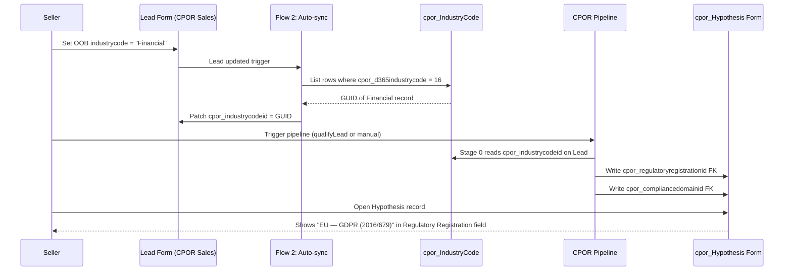

---

## Cross-Team Workflow

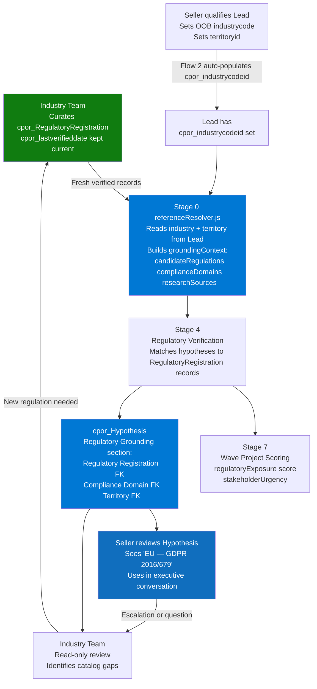

---

## Power Automate Flows

> Defined in [CRM Guide 06](context/2%20-%20Design/Industry%20CRM%20Implementation/Implementation%20Guide%20-%2006%20Power%20Automate%20Flows.txt)

### Flow 1 — Stale Registration Weekly Digest

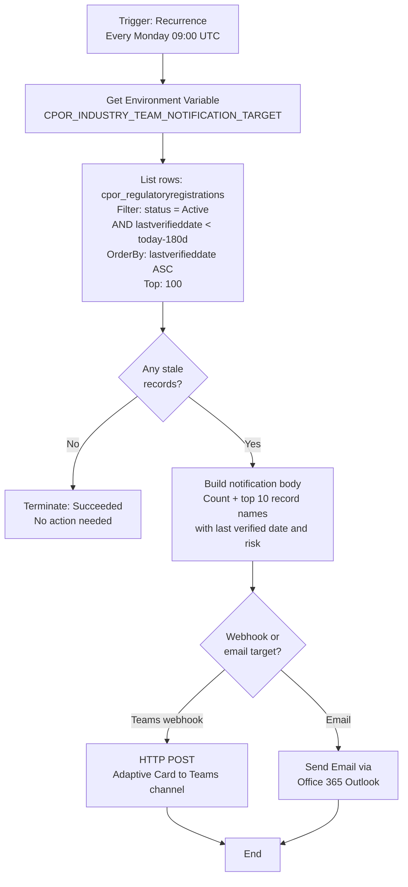

### Flow 2 — Lead industrycode Auto-sync

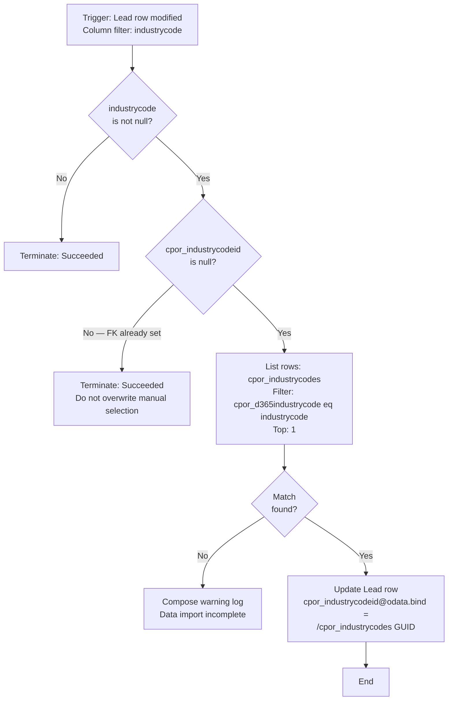

### Flow 3 — Lead → Account Industry Code Copy on Qualification

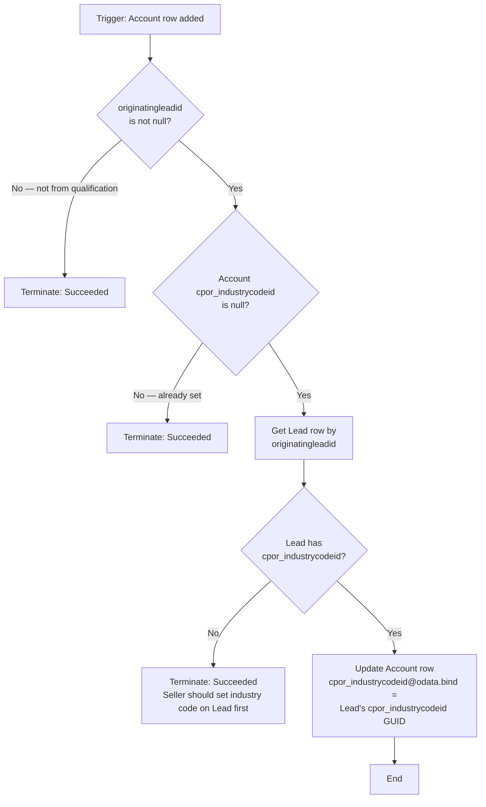

### Flow Summary

| Flow Name                                             | Trigger                             | Purpose                                         |
| ----------------------------------------------------- | ----------------------------------- | ----------------------------------------------- |
| CPOR — Stale Registration Weekly Digest               | Scheduled (Monday 09:00 UTC)        | Notify Industry Team of stale catalog records   |
| CPOR — Lead Industry Code Auto-sync                   | Lead `industrycode` column modified | Populate `cpor_industrycodeid` FK transparently |
| CPOR — Copy Industry Code to Account on Qualification | Account row added                   | Copy FK from source Lead to new Account         |

> **Note:** Assign all 3 flows to a shared service account (`CPOR-Automation@contoso.com`) so flow ownership persists beyond individual user tenure.

---

## Security Model

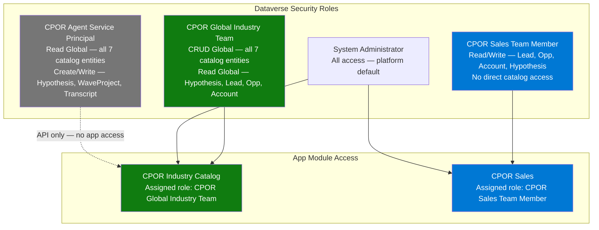

**Key principle:** Sales Team Members read catalog data _through FK expansion on forms they already have access to_ — they do not need, and are not granted, direct access to the catalog entities or the CPOR Industry Catalog app.

---

## Verification Reference

### Quick Health Check (OData)

```
# Entity record counts — run after GII 07 data import
GET /cpor_industrycodes?$count=true&$top=0          → expect 33
GET /cpor_compliancedomains?$count=true&$top=0      → expect 20
GET /cpor_regulatorysources?$count=true&$top=0      → expect 24+
GET /cpor_industrydomainmaps?$count=true&$top=0     → expect 150+
GET /cpor_territorysourcemaps?$count=true&$top=0    → expect 60+

# Freshness check — records stale >180 days
GET /cpor_regulatoryregistrations
  ?$filter=cpor_status eq 'Active'
  and cpor_lastverifieddate lt [today-180]
  &$count=true&$top=0
  → target: 0

# FK expansion spot check
GET /cpor_industrydomainmaps
  ?$expand=cpor_industrycodeid($select=cpor_name),
           cpor_compliancedomainid($select=cpor_name,cpor_domaincode)
  &$top=5
  → expect: both expanded names populated (not GUIDs)
```

### Post-Deployment Acceptance Checklist

| #   | Check                                                  | Expected                                                          |
| --- | ------------------------------------------------------ | ----------------------------------------------------------------- |
| 1   | Log in as CPOR Global Industry Team member             | Can access CPOR Industry Catalog; cannot access CPOR Sales        |
| 2   | Open Catalog Health dashboard                          | 6 tiles load; bar chart renders                                   |
| 3   | Navigate Taxonomy > Industry Codes                     | 33 rows visible                                                   |
| 4   | Navigate Registrations; open Active Registrations view | Default view loads; columns show expanded FK names                |
| 5   | Open a RegulatoryRegistration record                   | 6 sections visible; `cpor_lastverifieddate` label bold            |
| 6   | Set `cpor_status = Superseded` on a test record        | All fields except Analyst Notes lock (Business Rule 1)            |
| 7   | Set `cpor_mandatory = Yes` on a test record            | Compliance Deadline shows required indicator (Business Rule 2)    |
| 8   | Set Lead `industrycode` = Financial and save           | After 60 sec: `cpor_industrycodeid` populated (Flow 2)            |
| 9   | Qualify Lead to Account                                | After 60 sec: Account `cpor_industrycodeid` matches Lead (Flow 3) |
| 10  | Run Flow 1 manually with a stale test record           | Notification received at `CPOR_INDUSTRY_TEAM_NOTIFICATION_TARGET` |

---

## File Index

```
CPOR Industry Engagement/
├── README.md                                           ← this file
├── context/
│   ├── 0 - Discovery/
│   │   ├── microsoft_sales_industry_analysis_discussion.txt
│   │   ├── d365_regulatory_compliance_design_discussion.md
│   │   └── Industry Crosswalk/
│   │       ├── Industry Analysis ReadMe.txt
│   │       ├── Industry Codes.csv                      33 D365 industry codes
│   │       ├── Compliance Domains.csv                  20 compliance domain codes
│   │       ├── Territory.csv                           34 UN M49 hierarchy nodes
│   │       ├── Compliance Registry.csv                 24+ regulatory sources
│   │       ├── Industry Domain Matrix.csv              industry × domain crosswalk
│   │       ├── Territory Source Matrix.csv             territory × domain × source
│   │       └── Industry Import Template.csv            Dataverse import template
│   ├── 1 - Prompt/                                     (reserved — empty)
│   └── 2 - Design/
│       ├── customizations.xml                          D365 solution export
│       ├── Global Industry Implementation/             GII Guides 00–07
│       │   ├── Implementation Guide - 00 Overview.txt
│       │   ├── Implementation Guide - 01 Optionsets.txt
│       │   ├── Implementation Guide - 02 Taxonomy Entities.txt
│       │   ├── Implementation Guide - 03 Crosswalk Entities.txt
│       │   ├── Implementation Guide - 04 Resolution Entity.txt
│       │   ├── Implementation Guide - 05 FK Extensions and Relationships.txt
│       │   ├── Implementation Guide - 06 Security Roles.txt
│       │   └── Implementation Guide - 07 Data Import.txt
│       └── Industry CRM Implementation/               CRM Guides 00–06
│           ├── Implementation Guide - 00 Overview.txt
│           ├── Implementation Guide - 01 App Module and Site Map.txt
│           ├── Implementation Guide - 02 Views.txt
│           ├── Implementation Guide - 03 Forms.txt
│           ├── Implementation Guide - 04 Catalog Health Dashboard.txt
│           ├── Implementation Guide - 05 Business Rules.txt
│           └── Implementation Guide - 06 Power Automate Flows.txt
└── webresources/                                       (reserved for PCF/JS/CSS)
    ├── css/
    ├── html/
    ├── js/
    └── media/
```

---

_CPOR Durable · Global Industry Team · June 2026_
