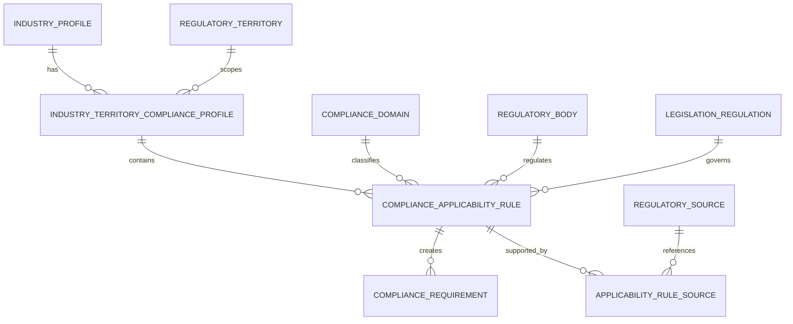
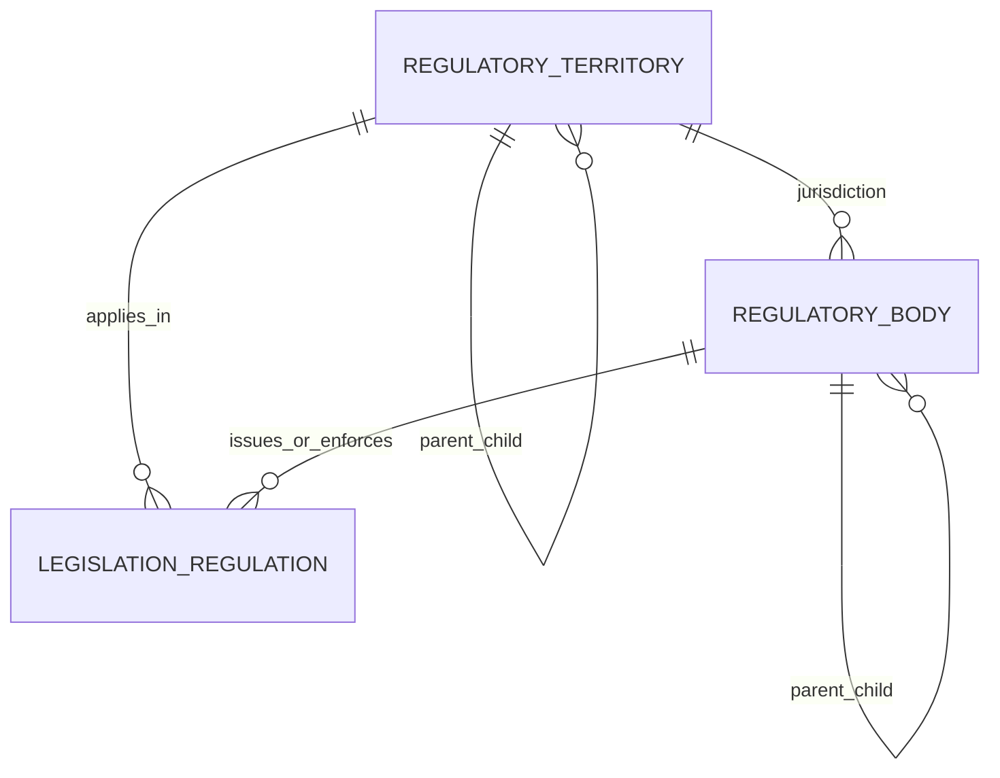
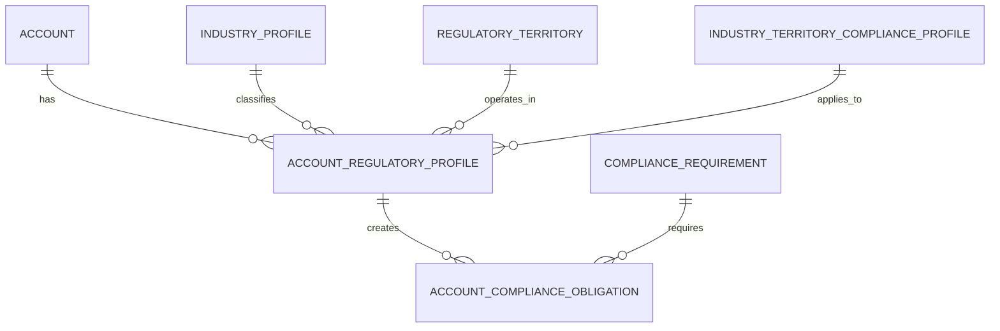
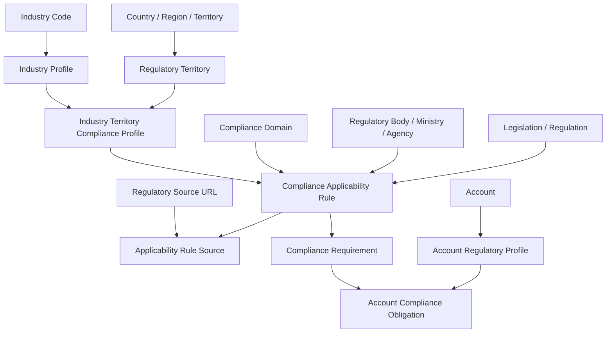
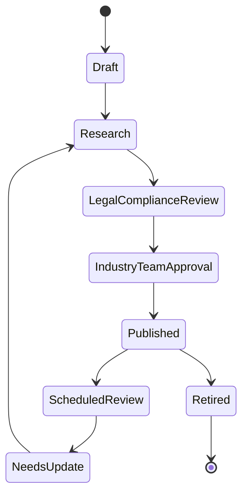
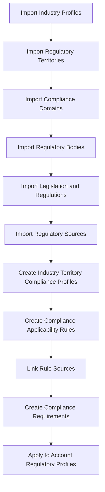

# Dynamics 365 Sales Regulatory & Compliance Intelligence Design

**Prepared for:** AI Engine's Workspace  
**Prepared by:** ChatGPT  
**Date:** 2026-06-13  
**Scope:** Microsoft Dynamics 365 Sales, Dataverse, global industry/territory regulatory intelligence, compliance agency/source tracking, and Industry Team-managed reference data.

---

## Table of Contents

- [1. Executive Summary](#1-executive-summary)
- [2. Conversation Log: Prompts and Responses](#2-conversation-log-prompts-and-responses)
- [3. Dynamics 365 Sales Industry Codes](#3-dynamics-365-sales-industry-codes)
- [4. Global Operating Territory Model](#4-global-operating-territory-model)
- [5. Regulatory / Compliance Matrix Concept](#5-regulatory--compliance-matrix-concept)
- [6. Dataverse Table Design](#6-dataverse-table-design)
- [7. Relationship Diagrams](#7-relationship-diagrams)
- [8. Security and Ownership Model](#8-security-and-ownership-model)
- [9. Business Process Flow](#9-business-process-flow)
- [10. Model-Driven App Design](#10-model-driven-app-design)
- [11. Views, Dashboards, and Rollups](#11-views-dashboards-and-rollups)
- [12. Data Import and Governance Strategy](#12-data-import-and-governance-strategy)
- [13. Implementation Checklist](#13-implementation-checklist)
- [14. Open Questions and Next Decisions](#14-open-questions-and-next-decisions)

---

## 1. Executive Summary

The discussion evolved from a request for the standard Microsoft Dynamics 365 Sales `industrycode` list into a broader design for a **global regulatory and compliance intelligence capability** in Dataverse.

The resulting design recognizes that regulatory information changes across:

- Industry
- Country
- Region
- Territory
- Compliance domain
- Regulator / ministry / agency
- Law / regulation / standard
- Source URL / official online resource
- Customer/account-specific applicability

Because of this complexity, the recommended architecture is **not** a simple option set. Instead, the solution should use normalized Dataverse tables, many-to-many mapping records, recurring review workflows, source validation, and account-level applicability records.

Recommended solution name:

```text
Industry Regulatory Intelligence
```

Recommended model-driven app name:

```text
Regulatory Intelligence Hub
```

Core concept:

```text
Industry Code + Territory + Compliance Domain
    -> Regulatory Bodies
    -> Legislation / Regulation
    -> Official Sources
    -> Applicability Rules
    -> Compliance Requirements
    -> Account Obligations
```

---

## 2. Conversation Log: Prompts and Responses

This section includes the full discussion captured as expandable Markdown sections.

---

<details>
<summary><strong>Prompt 1: Dynamics 365 Sales industry codes</strong></summary>

### User Prompt

> in Microsoft Dynamics 365 Sales what is the list of industry codes

### Assistant Response

In **Microsoft Dynamics 365 Sales / Dataverse**, the standard Account **Industry** field is:

- Display name: **Industry**
- Logical name: `industrycode`
- Type: **Picklist / Choice**
- Global choice name: `account_industrycode`

Default industry code values are:

| Value | Label |
|---:|---|
| 1 | Accounting |
| 2 | Agriculture and Non-petrol Natural Resource Extraction |
| 3 | Broadcasting Printing and Publishing |
| 4 | Brokers |
| 5 | Building Supply Retail |
| 6 | Business Services |
| 7 | Consulting |
| 8 | Consumer Services |
| 9 | Design, Direction and Creative Management |
| 10 | Distributors, Dispatchers and Processors |
| 11 | Doctor's Offices and Clinics |
| 12 | Durable Manufacturing |
| 13 | Eating and Drinking Places |
| 14 | Entertainment Retail |
| 15 | Equipment Rental and Leasing |
| 16 | Financial |
| 17 | Food and Tobacco Processing |
| 18 | Inbound Capital Intensive Processing |
| 19 | Inbound Repair and Services |
| 20 | Insurance |
| 21 | Legal Services |
| 22 | Non-Durable Merchandise Retail |
| 23 | Outbound Consumer Service |
| 24 | Petrochemical Extraction and Distribution |
| 25 | Service Retail |
| 26 | SIG Affiliations |
| 27 | Social Services |
| 28 | Special Outbound Trade Contractors |
| 29 | Specialty Realty |
| 30 | Transportation |
| 31 | Utility Creation and Distribution |
| 32 | Vehicle Retail |
| 33 | Wholesale |

Microsoft describes this field as the account's primary industry for marketing segmentation and demographic analysis.

</details>

---

<details>
<summary><strong>Prompt 2: Operation territories around the world</strong></summary>

### User Prompt

> Also i need a list of operation territories in the world

### Assistant Response

In **Dynamics 365 Sales**, there is no default worldwide “operation territory” option-set list like the `industrycode` list. Microsoft expects you to **create Sales Territories** based on your own market segments, geography, sales structure, or operating model.

A good global territory structure for Dynamics 365 would be:

| Territory Code | Territory Name |
|---|---|
| GLOBAL | Global |
| NAM | North America |
| LATAM | Latin America & Caribbean |
| EMEA | Europe, Middle East & Africa |
| EUROPE | Europe |
| MEA | Middle East & Africa |
| APAC | Asia Pacific |
| ANZ | Australia & New Zealand |

For a more detailed world territory list, use this:

| Territory Code | Territory Name | Parent Territory |
|---|---|---|
| NAM-US | United States | North America |
| NAM-CA | Canada | North America |
| NAM-MX | Mexico | North America |
| LATAM-CAM | Central America | Latin America & Caribbean |
| LATAM-CAR | Caribbean | Latin America & Caribbean |
| LATAM-SAM | South America | Latin America & Caribbean |
| EMEA-NEUR | Northern Europe | Europe |
| EMEA-WEUR | Western Europe | Europe |
| EMEA-SEUR | Southern Europe | Europe |
| EMEA-EEUR | Eastern Europe | Europe |
| EMEA-ME | Middle East / Western Asia | Middle East & Africa |
| EMEA-NAF | Northern Africa | Middle East & Africa |
| EMEA-WAF | Western Africa | Middle East & Africa |
| EMEA-EAF | Eastern Africa | Middle East & Africa |
| EMEA-CAF | Central / Middle Africa | Middle East & Africa |
| EMEA-SAF | Southern Africa | Middle East & Africa |
| APAC-EAS | Eastern Asia | Asia Pacific |
| APAC-SEA | Southeast Asia | Asia Pacific |
| APAC-SAS | Southern Asia | Asia Pacific |
| APAC-CAS | Central Asia | Asia Pacific |
| APAC-ANZ | Australia & New Zealand | Asia Pacific |
| APAC-MEL | Melanesia | Asia Pacific |
| APAC-MIC | Micronesia | Asia Pacific |
| APAC-POL | Polynesia | Asia Pacific |

For most Dynamics 365 Sales deployments, use **territories as records**, not as a choice column, because the Territory table can support hierarchy, ownership, assignment, and reporting.

Example import structure:

```csv
TerritoryCode,TerritoryName,ParentTerritory
GLOBAL,Global,
NAM,North America,GLOBAL
NAM-US,United States,NAM
NAM-CA,Canada,NAM
NAM-MX,Mexico,NAM
LATAM,Latin America & Caribbean,GLOBAL
LATAM-CAM,Central America,LATAM
LATAM-CAR,Caribbean,LATAM
LATAM-SAM,South America,LATAM
EMEA,Europe Middle East & Africa,GLOBAL
EMEA-EUR,Europe,EMEA
EMEA-NEUR,Northern Europe,EMEA-EUR
EMEA-WEUR,Western Europe,EMEA-EUR
EMEA-SEUR,Southern Europe,EMEA-EUR
EMEA-EEUR,Eastern Europe,EMEA-EUR
EMEA-MEA,Middle East & Africa,EMEA
EMEA-ME,Middle East / Western Asia,EMEA-MEA
EMEA-NAF,Northern Africa,EMEA-MEA
EMEA-WAF,Western Africa,EMEA-MEA
EMEA-EAF,Eastern Africa,EMEA-MEA
EMEA-CAF,Central / Middle Africa,EMEA-MEA
EMEA-SAF,Southern Africa,EMEA-MEA
APAC,Asia Pacific,GLOBAL
APAC-EAS,Eastern Asia,APAC
APAC-SEA,Southeast Asia,APAC
APAC-SAS,Southern Asia,APAC
APAC-CAS,Central Asia,APAC
APAC-OCE,Oceania,APAC
APAC-ANZ,Australia & New Zealand,APAC-OCE
APAC-MEL,Melanesia,APAC-OCE
APAC-MIC,Micronesia,APAC-OCE
APAC-POL,Polynesia,APAC-OCE
```

</details>

---

<details>
<summary><strong>Prompt 3: Regulatory, compliance, ministry, legislation, and governing bodies</strong></summary>

### User Prompt

> The next discussion is around regulatory/compliance/ministry for each industry and listing all the regulatory agencies and legislation and govenining bodies that regulate industries in each country, region, or terrtor

### Assistant Response

This should be modeled as a **regulatory intelligence layer** around each industry, country, region, and sales/operations territory.

For Dynamics 365, this should **not** be a single picklist. It should be a set of related reference tables because:

- One industry can be regulated by many agencies.
- One law can apply to many industries.
- One regulator can operate at country, state/province, regional, or supranational level.
- Some rules are conditional.
- Laws change over time.

Recommended tables:

| Table | Purpose |
|---|---|
| Regulatory Jurisdiction | Country, region, state/province, trade bloc |
| Regulatory Body | Ministry, agency, regulator, standards body |
| Legislation | Laws, acts, regulations, directives |
| Compliance Domain | Privacy, tax, healthcare, financial services, etc. |
| Industry Regulation Mapping | Main applicability matrix |
| Compliance Requirement | Specific obligations such as licensing, filings, reporting |
| Compliance Evidence | Documents or proof required |
| Regulatory Update | Changes, alerts, effective dates |
| Account Regulatory Profile | Applies rules to a specific customer/account |

Core compliance domains:

| Compliance Domain | Common Regulators / Bodies |
|---|---|
| Corporate Registration | Companies registry, commerce ministry |
| Tax | Tax authority, revenue service |
| Employment / Labor | Labor ministry, employment standards agency |
| Data Protection / Privacy | Data protection authority |
| Cybersecurity | Cybersecurity agency, communications regulator |
| Financial Services | Central bank, securities regulator, insurance regulator |
| Banking / Payments | Central bank, payments authority |
| Healthcare | Health ministry, medical products regulator |
| Pharmaceuticals | Drug regulator, health authority |
| Food & Beverage | Food safety agency, agriculture ministry |
| Energy | Energy ministry, utilities regulator |
| Telecommunications | Communications regulator |
| Transportation | Transport ministry, aviation/maritime/rail authorities |
| Environment | Environmental protection agency |
| Consumer Protection | Consumer affairs authority |
| Competition / Antitrust | Competition authority |
| Trade / Customs | Customs authority, trade ministry |
| Government Contracting | Procurement authority |
| Education | Education ministry |
| Real Estate / Construction | Housing ministry, building authority |
| Legal Services | Bar association, justice ministry |
| Accounting / Audit | Accountancy board, audit oversight body |
| Insurance | Insurance regulator |
| Mining / Natural Resources | Mining ministry, natural resources authority |
| Agriculture | Agriculture ministry, food/agriculture regulator |

Recommended relationship model:

```text
Industry
   ↓
Industry Regulation Mapping
   ↑        ↑         ↑
Territory   Regulator Legislation
   ↓
Country / Region / State
```

For Account-level use:

```text
Account
   ↓
Account Industry
   ↓
Operating Territories
   ↓
Applicable Regulatory Profile
   ↓
Compliance Requirements
```

</details>

---

<details>
<summary><strong>Prompt 4: Include websites and online resources, create matrix by industry code</strong></summary>

### User Prompt

> lets include all the websites or online resources for all regulatory/compliance agencies or bodies in each territory/region and create a matrix by each industry code

### Assistant Response

Created an Excel workbook:

```text
/mnt/data/d365_global_regulatory_compliance_matrix.xlsx
```

Workbook sheets:

| Sheet | What it contains |
|---|---|
| README | Usage notes, Dataverse table recommendations, and limitations |
| Industry Codes | All 33 Dynamics 365 Account `industrycode` values |
| Territories | Global, NAM, LATAM, EMEA, APAC, EU, and subregion hierarchy |
| Compliance Domains | Normalized regulatory areas like tax, labor, privacy, financial services, healthcare, food, environment, telecom, transport, energy, etc. |
| Source Registry | Official/authoritative online resources and regulator directories |
| Industry x Domain Matrix | Matrix mapping each Dynamics industry code to applicable compliance domains, regulator types, and source URLs |
| Territory x Source Matrix | Territory/region-by-domain source lookup matrix |
| Import Template | Dataverse-ready structure for `Industry Regulation Mapping` records |
| Dashboard | Workbook counts and quick summary |

The workbook was structured as a scalable source-backed matrix, rather than trying to statically enumerate every law and agency in every country.

</details>

---

<details>
<summary><strong>Prompt 5: Dataverse table design for Industry Team-managed regulatory tracking</strong></summary>

### User Prompt

> We know that regullatory/compliance source change industry->territory/region. I want to track this information in Dynamics 365 as organization entities to be managed by the Industry team. Generate me some table design to track this in dataverse

### Assistant Response Summary

A Dataverse-friendly schema was recommended with:

- Organization-owned reference tables
- User/team-owned matrix and operational tables
- Industry Team ownership for compliance profiles and applicability rules
- Source registry for official websites
- Change management and recurring review tables
- Account-level regulatory profiles and obligations

Core tables proposed:

| Table | Purpose |
|---|---|
| Industry Profile | Normalizes Dynamics 365 `industrycode` values |
| Regulatory Territory | Stores countries, regions, trade blocs, and sales territory mappings |
| Compliance Domain | Standardizes regulatory subject areas |
| Regulatory Body | Stores ministries, agencies, authorities, and governing bodies |
| Legislation and Regulation | Stores laws, rules, directives, acts, standards, and guidance |
| Industry Territory Compliance Profile | Matrix header for industry + territory compliance posture |
| Compliance Applicability Rule | Detailed mapping of industry, territory, domain, regulator, law, and applicability |
| Regulatory Source | Stores official websites and online resources |
| Applicability Rule Source | Bridge table between rules and sources |
| Compliance Requirement | Specific license, filing, audit, report, or registration obligations |
| Compliance Evidence Type | Defines evidence required for requirements |
| Account Regulatory Profile | Applies reference data to a specific Account |
| Account Compliance Obligation | Tracks account-level compliance obligations |
| Regulatory Update | Tracks changes in laws, guidance, sources, and regulatory developments |
| Regulatory Review | Tracks review and approval process by the Industry Team |

</details>

---

## 3. Dynamics 365 Sales Industry Codes

The following industry codes are used as the starting taxonomy for the compliance matrix.

| Industry Code | Industry Label |
|---:|---|
| 1 | Accounting |
| 2 | Agriculture and Non-petrol Natural Resource Extraction |
| 3 | Broadcasting Printing and Publishing |
| 4 | Brokers |
| 5 | Building Supply Retail |
| 6 | Business Services |
| 7 | Consulting |
| 8 | Consumer Services |
| 9 | Design, Direction and Creative Management |
| 10 | Distributors, Dispatchers and Processors |
| 11 | Doctor's Offices and Clinics |
| 12 | Durable Manufacturing |
| 13 | Eating and Drinking Places |
| 14 | Entertainment Retail |
| 15 | Equipment Rental and Leasing |
| 16 | Financial |
| 17 | Food and Tobacco Processing |
| 18 | Inbound Capital Intensive Processing |
| 19 | Inbound Repair and Services |
| 20 | Insurance |
| 21 | Legal Services |
| 22 | Non-Durable Merchandise Retail |
| 23 | Outbound Consumer Service |
| 24 | Petrochemical Extraction and Distribution |
| 25 | Service Retail |
| 26 | SIG Affiliations |
| 27 | Social Services |
| 28 | Special Outbound Trade Contractors |
| 29 | Specialty Realty |
| 30 | Transportation |
| 31 | Utility Creation and Distribution |
| 32 | Vehicle Retail |
| 33 | Wholesale |

---

## 4. Global Operating Territory Model

### Territory hierarchy

| Territory Code | Territory Name | Parent Territory |
|---|---|---|
| GLOBAL | Global |  |
| NAM | North America | GLOBAL |
| NAM-US | United States | NAM |
| NAM-CA | Canada | NAM |
| NAM-MX | Mexico | NAM |
| LATAM | Latin America & Caribbean | GLOBAL |
| LATAM-CAM | Central America | LATAM |
| LATAM-CAR | Caribbean | LATAM |
| LATAM-SAM | South America | LATAM |
| EMEA | Europe, Middle East & Africa | GLOBAL |
| EMEA-EUR | Europe | EMEA |
| EMEA-NEUR | Northern Europe | EMEA-EUR |
| EMEA-WEUR | Western Europe | EMEA-EUR |
| EMEA-SEUR | Southern Europe | EMEA-EUR |
| EMEA-EEUR | Eastern Europe | EMEA-EUR |
| EMEA-MEA | Middle East & Africa | EMEA |
| EMEA-ME | Middle East / Western Asia | EMEA-MEA |
| EMEA-NAF | Northern Africa | EMEA-MEA |
| EMEA-WAF | Western Africa | EMEA-MEA |
| EMEA-EAF | Eastern Africa | EMEA-MEA |
| EMEA-CAF | Central / Middle Africa | EMEA-MEA |
| EMEA-SAF | Southern Africa | EMEA-MEA |
| APAC | Asia Pacific | GLOBAL |
| APAC-EAS | Eastern Asia | APAC |
| APAC-SEA | Southeast Asia | APAC |
| APAC-SAS | Southern Asia | APAC |
| APAC-CAS | Central Asia | APAC |
| APAC-OCE | Oceania | APAC |
| APAC-ANZ | Australia & New Zealand | APAC-OCE |
| APAC-MEL | Melanesia | APAC-OCE |
| APAC-MIC | Micronesia | APAC-OCE |
| APAC-POL | Polynesia | APAC-OCE |

### Territory design principle

Keep **sales territories** and **regulatory territories** related but separate.

Sales territory examples:

- North America Enterprise
- Federal Civilian
- EMEA Public Sector
- APAC Commercial

Regulatory territory examples:

- United States
- European Union
- California
- United Kingdom
- ASEAN
- Gulf Cooperation Council

A regulatory territory may overlap multiple sales territories, and a sales territory may contain many regulatory jurisdictions.

---

## 5. Regulatory / Compliance Matrix Concept

### Problem statement

Regulatory and compliance sources vary by:

| Dimension | Example |
|---|---|
| Industry | Financial, Healthcare, Telecommunications |
| Territory | United States, European Union, Canada, APAC |
| Compliance Domain | Privacy, Tax, Labor, Financial Services |
| Regulator | SEC, HHS, EDPB, FCA |
| Legislation | GDPR, HIPAA, Securities Exchange Act |
| Source Type | Official law, regulator guidance, licensing portal |
| Applicability | Mandatory, conditional, advisory |
| Review Status | Draft, approved, needs update |

### Main matrix grain

The core data grain is:

```text
Industry Profile
+ Regulatory Territory
+ Compliance Domain
+ Regulatory Body
+ Legislation / Regulation
+ Source
+ Applicability Rule
```

### Matrix example

| Industry | Territory | Domain | Regulator | Legislation | Applicability |
|---|---|---|---|---|---|
| Financial | United States | Financial Services | Securities and Exchange Commission | Securities Exchange Act | Applies to securities market activity |
| Healthcare | United States | Privacy | HHS Office for Civil Rights | HIPAA | Applies to covered entities and business associates |
| Telecommunications | European Union | Data Protection | European Data Protection Board | GDPR | Applies to personal data processing in the EU |
| Energy | United Kingdom | Energy | Office of Gas and Electricity Markets | Electricity Act | Applies to gas and electricity markets |

---

## 6. Dataverse Table Design

## 6.1 Industry Profile

**Table display name:** Industry Profile  
**Schema name:** `ae_industryprofile`  
**Ownership:** Organization-owned  
**Primary column:** `ae_name`

| Column | Type | Example | Notes |
|---|---|---|---|
| `ae_name` | Text | Financial | Primary name |
| `ae_d365industrycode` | Whole Number | 16 | Maps to Account `industrycode` value |
| `ae_d365industrylabel` | Text | Financial | Dynamics label |
| `ae_externalclassificationtype` | Choice | NAICS | Optional external taxonomy |
| `ae_externalclassificationcode` | Text | 52 | External classification code |
| `ae_risklevel` | Choice | High | Low, Medium, High, Critical |
| `ae_requirescompliancereview` | Yes/No | Yes | Flags industries needing review |
| `ae_active` | Yes/No | Yes | Active reference value |
| `ae_industryowner` | Lookup → User/Team | Financial Services Industry Team | Owner/steward |
| `ae_description` | Multiline Text | Industry definition | Scope notes |

---

## 6.2 Regulatory Territory

**Table display name:** Regulatory Territory  
**Schema name:** `ae_regulatoryterritory`  
**Ownership:** Organization-owned  
**Primary column:** `ae_name`

| Column | Type | Example | Notes |
|---|---|---|---|
| `ae_name` | Text | United States | Territory name |
| `ae_territorycode` | Text | US | Internal territory code |
| `ae_territorytype` | Choice | Country | Global, Region, Subregion, Country, State/Province, Trade Bloc, Sales Territory |
| `ae_parentterritoryid` | Lookup → Regulatory Territory | North America | Self-referencing hierarchy |
| `ae_iso2code` | Text | US | Country code |
| `ae_iso3code` | Text | USA | Country code |
| `ae_unm49code` | Text | 840 | UN M49 region/country code |
| `ae_salesregion` | Choice/Text | NAM | Internal sales region |
| `ae_d365territoryid` | Lookup → Territory | United States Sales Territory | Optional relationship to Dynamics Sales Territory |
| `ae_active` | Yes/No | Yes | Active reference value |

---

## 6.3 Compliance Domain

**Table display name:** Compliance Domain  
**Schema name:** `ae_compliancedomain`  
**Ownership:** Organization-owned  
**Primary column:** `ae_name`

| Column | Type | Example | Notes |
|---|---|---|---|
| `ae_name` | Text | Data Protection / Privacy | Domain name |
| `ae_domaincode` | Text | PRIVACY | Stable code |
| `ae_parentdomainid` | Lookup → Compliance Domain | Corporate Compliance | Self-referencing hierarchy |
| `ae_description` | Multiline Text | Laws and regulators related to personal data | Definition |
| `ae_defaultreviewfrequency` | Choice | Quarterly | Suggested review cycle |
| `ae_defaultimpactlevel` | Choice | High | Low, Medium, High, Critical |
| `ae_active` | Yes/No | Yes | Active reference value |

### Suggested compliance domains

| Domain Code | Domain |
|---|---|
| CORPREG | Corporate Registration |
| TAX | Tax |
| LABOR | Employment / Labor |
| PRIVACY | Data Protection / Privacy |
| CYBER | Cybersecurity |
| FIN | Financial Services |
| BANKING | Banking / Payments |
| HEALTH | Healthcare |
| PHARMA | Pharmaceuticals |
| FOOD | Food Safety |
| ENV | Environment |
| ENERGY | Energy / Utilities |
| TELECOM | Telecommunications |
| TRANSPORT | Transportation |
| COMP | Competition / Antitrust |
| TRADE | Trade / Customs |
| PROCUREMENT | Government Contracting |
| EDUCATION | Education |
| REAL_ESTATE | Real Estate / Construction |
| LEGAL | Legal Services |
| ACCOUNTING | Accounting / Audit |
| INSURANCE | Insurance |
| MINING | Mining / Natural Resources |
| AGRI | Agriculture |

---

## 6.4 Regulatory Body

**Table display name:** Regulatory Body  
**Schema name:** `ae_regulatorybody`  
**Ownership:** Organization-owned  
**Primary column:** `ae_name`

| Column | Type | Example | Notes |
|---|---|---|---|
| `ae_name` | Text | Securities and Exchange Commission | Full name |
| `ae_shortname` | Text | SEC | Acronym |
| `ae_bodytype` | Choice | Independent Regulatory Agency | Ministry, central bank, authority, etc. |
| `ae_territoryid` | Lookup → Regulatory Territory | United States | Jurisdiction |
| `ae_parentbodyid` | Lookup → Regulatory Body | Department of the Treasury | Optional parent body |
| `ae_primarydomainid` | Lookup → Compliance Domain | Financial Services | Primary domain |
| `ae_jurisdictionlevel` | Choice | National | Global, Regional, National, State/Province, Local |
| `ae_officialwebsite` | URL | https://www.sec.gov | Official website |
| `ae_contactpageurl` | URL | Contact page | Optional |
| `ae_legislationpageurl` | URL | Rules and laws page | Optional |
| `ae_guidancepageurl` | URL | Guidance page | Optional |
| `ae_status` | Choice | Active | Active, Renamed, Merged, Repealed, Deprecated |
| `ae_effectivefrom` | Date | 1934-06-06 | Optional |
| `ae_effectiveto` | Date |  | Optional |
| `ae_notes` | Multiline Text | Scope notes | Optional |

### Recommended `ae_bodytype` choices

| Value |
|---|
| Ministry / Department |
| Independent Regulatory Agency |
| Supervisory Authority |
| Licensing Authority |
| Standards Body |
| Enforcement Agency |
| Data Protection Authority |
| Competition / Antitrust Authority |
| Environmental Authority |
| Financial Intelligence Unit |
| Tax Authority |
| Customs / Trade Authority |
| Central Bank |
| Health Authority |
| Industry Association |
| Self-Regulatory Organization |
| Supranational Body |

---

## 6.5 Legislation and Regulation

**Table display name:** Legislation and Regulation  
**Schema name:** `ae_legislation`  
**Ownership:** Organization-owned  
**Primary column:** `ae_name`

| Column | Type | Example | Notes |
|---|---|---|---|
| `ae_name` | Text | General Data Protection Regulation | Full name |
| `ae_shortname` | Text | GDPR | Acronym or short name |
| `ae_legaltype` | Choice | Regulation | Act, law, directive, etc. |
| `ae_territoryid` | Lookup → Regulatory Territory | European Union | Jurisdiction |
| `ae_primarydomainid` | Lookup → Compliance Domain | Data Protection / Privacy | Primary domain |
| `ae_issuingbodyid` | Lookup → Regulatory Body | European Parliament / Council | Issuing body |
| `ae_enforcingbodyid` | Lookup → Regulatory Body | Data Protection Authorities | Enforcing body |
| `ae_officialurl` | URL | Official law page | Official legal source |
| `ae_summaryurl` | URL | Official summary page | Optional |
| `ae_effectivedate` | Date | 2018-05-25 | Effective date |
| `ae_status` | Choice | Active | Draft, Active, Amended, Repealed, Superseded |
| `ae_version` | Text | 2016/679 | Version/reference |
| `ae_lastvalidatedon` | Date | 2026-06-13 | Last validation date |
| `ae_validatedby` | Lookup → User | Compliance Analyst | Validator |
| `ae_notes` | Multiline Text | Applicability summary | Optional |

### Recommended `ae_legaltype` choices

| Value |
|---|
| Act |
| Law |
| Regulation |
| Directive |
| Rule |
| Code |
| Standard |
| Guidance |
| Circular |
| Executive Order |
| Ministerial Order |
| Licensing Requirement |
| Reporting Requirement |
| Enforcement Notice |
| Treaty |
| Framework |
| Policy |

---

## 6.6 Industry Territory Compliance Profile

This is the matrix header table.

**Table display name:** Industry Territory Compliance Profile  
**Schema name:** `ae_industryterritorycomplianceprofile`  
**Ownership:** User/team-owned  
**Primary column:** `ae_name`

| Column | Type | Example | Notes |
|---|---|---|---|
| `ae_name` | Autonumber/Text | Financial - United States - High | Primary name |
| `ae_industryprofileid` | Lookup → Industry Profile | Financial | Industry |
| `ae_territoryid` | Lookup → Regulatory Territory | United States | Territory |
| `ae_overallriskrating` | Choice | High | Overall rating |
| `ae_profileownerteam` | Lookup → Team | Financial Services Industry Team | Managing team |
| `ae_reviewstatus` | Choice | Approved | Draft, In Review, Approved, Needs Update, Archived |
| `ae_reviewfrequency` | Choice | Quarterly | Review cadence |
| `ae_nextreviewdate` | Date | 2026-09-30 | Next review |
| `ae_lastreviewedon` | Date | 2026-06-13 | Last review |
| `ae_lastreviewedby` | Lookup → User | Industry Compliance Lead | Reviewer |
| `ae_businessimpactsummary` | Multiline Text | Major financial licensing and reporting applies | Summary |
| `ae_active` | Yes/No | Yes | Active flag |

### Suggested alternate key

```text
ae_industryprofileid + ae_territoryid
```

This prevents duplicate compliance profiles for the same industry-territory combination.

---

## 6.7 Compliance Applicability Rule

This is the core mapping table.

**Table display name:** Compliance Applicability Rule  
**Schema name:** `ae_complianceapplicabilityrule`  
**Ownership:** User/team-owned  
**Primary column:** `ae_name`

| Column | Type | Example | Notes |
|---|---|---|---|
| `ae_name` | Text/Autonumber | Financial-US-SEC-Securities Exchange Act | Primary name |
| `ae_profileid` | Lookup → Industry Territory Compliance Profile | Financial - United States | Parent matrix profile |
| `ae_compliancedomainid` | Lookup → Compliance Domain | Financial Services | Domain |
| `ae_regulatorybodyid` | Lookup → Regulatory Body | SEC | Regulator |
| `ae_legislationid` | Lookup → Legislation and Regulation | Securities Exchange Act | Law or regulation |
| `ae_applicabilitytype` | Choice | Mandatory | Mandatory, Conditional, Advisory, Not Applicable |
| `ae_applicabilitycondition` | Multiline Text | Applies to public companies, broker-dealers, securities exchanges | Conditional logic |
| `ae_obligationtype` | Choice | Filing | License, registration, filing, disclosure, audit, etc. |
| `ae_riskrating` | Choice | High | Risk level |
| `ae_enforcementrisk` | Choice | High | Enforcement likelihood/severity |
| `ae_penaltysummary` | Multiline Text | Civil, administrative, or criminal penalties may apply | Penalty summary |
| `ae_effectivefrom` | Date | 1934-06-06 | Start date |
| `ae_effectiveto` | Date |  | End date |
| `ae_status` | Choice | Active | Draft, Active, Under Review, Retired |
| `ae_confidencelevel` | Choice | Verified | Low, Medium, High, Verified |
| `ae_sourceurl` | URL | Official regulator/law page | Primary URL shortcut |
| `ae_lastvalidatedon` | Date | 2026-06-13 | Last validation date |
| `ae_validatedby` | Lookup → User | Compliance Analyst | Validator |

---

## 6.8 Regulatory Source

**Table display name:** Regulatory Source  
**Schema name:** `ae_regulatorysource`  
**Ownership:** Organization-owned  
**Primary column:** `ae_name`

| Column | Type | Example | Notes |
|---|---|---|---|
| `ae_name` | Text | SEC Laws and Rules | Source name |
| `ae_sourcetype` | Choice | Official Regulator Website | Type of source |
| `ae_url` | URL | https://www.sec.gov/rules-regulations | URL |
| `ae_territoryid` | Lookup → Regulatory Territory | United States | Territory |
| `ae_regulatorybodyid` | Lookup → Regulatory Body | SEC | Regulator |
| `ae_legislationid` | Lookup → Legislation and Regulation | Securities Exchange Act | Optional law/regulation |
| `ae_compliancedomainid` | Lookup → Compliance Domain | Financial Services | Domain |
| `ae_publisher` | Text | U.S. Securities and Exchange Commission | Publisher |
| `ae_authoritylevel` | Choice | Primary | Primary, Secondary, Guidance, Commentary |
| `ae_refreshfrequency` | Choice | Monthly | Refresh cadence |
| `ae_lastcheckedon` | Date | 2026-06-13 | Link/source check date |
| `ae_lastcheckstatus` | Choice | Valid | Valid, Broken Link, Redirected, Needs Review |
| `ae_notes` | Multiline Text | Primary regulator source | Notes |

### Recommended `ae_sourcetype` choices

| Source Type |
|---|
| Official Regulator Website |
| Official Legal Gazette |
| Ministry Website |
| Government Portal |
| Treaty / Supranational Portal |
| Standards Body Website |
| Licensing Portal |
| Reporting Portal |
| Guidance / FAQ |
| Enforcement Database |
| Public Register |
| Official Dataset |
| Industry Body Resource |
| Internal Research Note |

---

## 6.9 Applicability Rule Source

This bridge table connects rules to one or more supporting sources.

**Table display name:** Applicability Rule Source  
**Schema name:** `ae_applicabilityrulesource`  
**Ownership:** Organization-owned  
**Primary column:** `ae_name`

| Column | Type | Example | Notes |
|---|---|---|---|
| `ae_name` | Autonumber | ARS-000001 | Primary name |
| `ae_complianceapplicabilityruleid` | Lookup → Compliance Applicability Rule | Financial-US-SEC | Rule |
| `ae_regulatorysourceid` | Lookup → Regulatory Source | SEC Rules and Regulations | Source |
| `ae_sourcepurpose` | Choice | Primary Legal Authority | Purpose |
| `ae_notes` | Multiline Text | Used to validate applicability | Notes |

Use a custom intersect table instead of a native many-to-many relationship because you need metadata such as source purpose, validation notes, and evidence strength.

---

## 6.10 Compliance Requirement

**Table display name:** Compliance Requirement  
**Schema name:** `ae_compliancerequirement`  
**Ownership:** User/team-owned  
**Primary column:** `ae_name`

| Column | Type | Example | Notes |
|---|---|---|---|
| `ae_name` | Text | Register as broker-dealer | Requirement name |
| `ae_applicabilityruleid` | Lookup → Compliance Applicability Rule | Financial-US-SEC | Parent rule |
| `ae_requirementtype` | Choice | Registration | Type |
| `ae_description` | Multiline Text | Entity must register before conducting broker-dealer activity | Details |
| `ae_duefrequency` | Choice | One-time | Due frequency |
| `ae_evidencerequired` | Yes/No | Yes | Evidence needed |
| `ae_defaultownerteam` | Lookup → Team | Compliance Operations | Owner team |
| `ae_riskrating` | Choice | High | Risk |
| `ae_status` | Choice | Active | Status |

### Recommended requirement types

| Requirement Type |
|---|
| License |
| Registration |
| Permit |
| Filing |
| Disclosure |
| Reporting |
| Certification |
| Audit |
| Inspection |
| Recordkeeping |
| Training |
| Data Protection Assessment |
| Security Control |
| Tax Registration |
| Import / Export Authorization |
| Product Approval |
| Professional Accreditation |

---

## 6.11 Compliance Evidence Type

**Table display name:** Compliance Evidence Type  
**Schema name:** `ae_complianceevidencetype`  
**Ownership:** Organization-owned  
**Primary column:** `ae_name`

| Column | Type | Example | Notes |
|---|---|---|---|
| `ae_name` | Text | License Certificate | Evidence type |
| `ae_evidencetypecode` | Text | LICENSE_CERT | Stable code |
| `ae_description` | Multiline Text | Official proof of license | Description |
| `ae_expirationtrackingrequired` | Yes/No | Yes | Track expiry |
| `ae_defaultreminderdays` | Whole Number | 60 | Reminder days before expiration |
| `ae_active` | Yes/No | Yes | Active flag |

---

## 6.12 Account Regulatory Profile

This table links reference/matrix data to actual customer Accounts.

**Table display name:** Account Regulatory Profile  
**Schema name:** `ae_accountregulatoryprofile`  
**Ownership:** User/team-owned  
**Primary column:** `ae_name`

| Column | Type | Example | Notes |
|---|---|---|---|
| `ae_name` | Autonumber/Text | Contoso - Financial - US | Primary name |
| `ae_accountid` | Lookup → Account | Contoso Bank | Customer account |
| `ae_industryprofileid` | Lookup → Industry Profile | Financial | Industry |
| `ae_territoryid` | Lookup → Regulatory Territory | United States | Territory |
| `ae_profileid` | Lookup → Industry Territory Compliance Profile | Financial - United States | Matrix profile |
| `ae_assessmentstatus` | Choice | In Progress | Not Started, In Progress, Reviewed, Approved, Exception |
| `ae_overallriskrating` | Choice | High | Account risk |
| `ae_assignedcomplianceowner` | Lookup → User/Team | Compliance Analyst | Owner |
| `ae_nextreviewdate` | Date | 2026-09-30 | Next account review |
| `ae_notes` | Multiline Text | Account-specific applicability notes | Notes |

---

## 6.13 Account Compliance Obligation

**Table display name:** Account Compliance Obligation  
**Schema name:** `ae_accountcomplianceobligation`  
**Ownership:** User/team-owned  
**Primary column:** `ae_name`

| Column | Type | Example | Notes |
|---|---|---|---|
| `ae_name` | Text | Contoso - SEC annual filing review | Primary name |
| `ae_accountregulatoryprofileid` | Lookup → Account Regulatory Profile | Contoso - Financial - US | Account profile |
| `ae_compliancerequirementid` | Lookup → Compliance Requirement | SEC filing requirement | Requirement |
| `ae_obligationstatus` | Choice | Open | Not Applicable, Open, In Progress, Complete, Exception, Overdue |
| `ae_duedate` | Date | 2026-12-31 | Due date |
| `ae_ownerid` | Owner | Compliance Operations | Owner |
| `ae_evidenceurl` | URL | SharePoint document link | Evidence URL |
| `ae_evidencestatus` | Choice | Submitted | Missing, Submitted, Approved, Rejected, Expired |
| `ae_exceptionreason` | Multiline Text | Not applicable due to customer classification | Exception notes |

---

## 6.14 Regulatory Update

**Table display name:** Regulatory Update  
**Schema name:** `ae_regulatoryupdate`  
**Ownership:** User/team-owned  
**Primary column:** `ae_name`

| Column | Type | Example | Notes |
|---|---|---|---|
| `ae_name` | Text | SEC cybersecurity disclosure rule update | Update title |
| `ae_updatetype` | Choice | New Law | New Law, Amendment, Guidance, Enforcement, Website Change, Repeal |
| `ae_regulatorybodyid` | Lookup → Regulatory Body | SEC | Regulator |
| `ae_legislationid` | Lookup → Legislation and Regulation | SEC Cybersecurity Rule | Law/regulation |
| `ae_sourceid` | Lookup → Regulatory Source | SEC Rules Page | Source |
| `ae_territoryid` | Lookup → Regulatory Territory | United States | Territory |
| `ae_compliancedomainid` | Lookup → Compliance Domain | Cybersecurity | Domain |
| `ae_publisheddate` | Date | 2026-06-01 | Published date |
| `ae_effectivedate` | Date | 2026-09-01 | Effective date |
| `ae_impactlevel` | Choice | High | Low, Medium, High, Critical |
| `ae_industryimpactsummary` | Multiline Text | May impact public companies and regulated financial entities | Summary |
| `ae_reviewstatus` | Choice | Triage | New, Triage, In Review, Mapped, No Impact, Closed |
| `ae_assignedto` | Lookup → User/Team | Financial Services Industry Team | Assigned reviewer |

---

## 6.15 Regulatory Review

**Table display name:** Regulatory Review  
**Schema name:** `ae_regulatoryreview`  
**Ownership:** User/team-owned  
**Primary column:** `ae_name`

| Column | Type | Example | Notes |
|---|---|---|---|
| `ae_name` | Text | Q3 2026 Financial-US Review | Review title |
| `ae_profileid` | Lookup → Industry Territory Compliance Profile | Financial - United States | Reviewed profile |
| `ae_reviewtype` | Choice | Scheduled | Scheduled, Triggered by Update, Annual Certification, Spot Check |
| `ae_reviewperiodstart` | Date | 2026-07-01 | Review period start |
| `ae_reviewperiodend` | Date | 2026-09-30 | Review period end |
| `ae_reviewowner` | Lookup → User/Team | Industry Team | Review owner |
| `ae_reviewstatus` | Choice | In Progress | Not Started, In Progress, Pending Approval, Approved, Rework Required |
| `ae_findings` | Multiline Text | Summary of findings | Findings |
| `ae_approvedby` | Lookup → User | Compliance Director | Approver |
| `ae_approvedon` | Date | 2026-09-30 | Approval date |

---

## 7. Relationship Diagrams

### 7.1 High-level regulatory matrix model



### 7.2 Territory and regulator hierarchy



### 7.3 Account-level compliance consumption



### 7.4 End-to-end flow



### 7.5 Business process lifecycle



---

## 8. Security and Ownership Model

Recommended ownership model:

| Table | Ownership | Managed By |
|---|---|---|
| Industry Profile | Organization-owned | Admin / Industry Data Steward |
| Regulatory Territory | Organization-owned | Admin / Data Governance |
| Compliance Domain | Organization-owned | Compliance Data Steward |
| Regulatory Body | Organization-owned | Industry Team / Compliance Team |
| Legislation and Regulation | Organization-owned | Legal / Compliance |
| Regulatory Source | Organization-owned | Compliance Research Team |
| Industry Territory Compliance Profile | User/team-owned | Industry Team |
| Compliance Applicability Rule | User/team-owned | Industry Team |
| Compliance Requirement | User/team-owned | Compliance Operations |
| Regulatory Update | User/team-owned | Industry Team |
| Regulatory Review | User/team-owned | Industry Team |
| Account Regulatory Profile | User/team-owned | Account Team / Compliance |
| Account Compliance Obligation | User/team-owned | Compliance Operations |

### Suggested security roles

| Security Role | Capabilities |
|---|---|
| Regulatory Intelligence Admin | Full configure/manage access |
| Industry Data Steward | Create/update industry profiles, compliance profiles, rules |
| Compliance Researcher | Create/update regulatory bodies, sources, legislation drafts |
| Legal Reviewer | Approve legislation/regulation and applicability rules |
| Industry Team Approver | Publish profiles and applicability rules |
| Account Compliance User | Read matrix, create account profiles and obligations |
| Sales User | Read published compliance summary only |

### Auditing recommendation

Enable Dataverse auditing for:

- Regulatory Body
- Legislation and Regulation
- Regulatory Source
- Industry Territory Compliance Profile
- Compliance Applicability Rule
- Compliance Requirement
- Account Regulatory Profile
- Account Compliance Obligation
- Regulatory Update
- Regulatory Review

---

## 9. Business Process Flow

Recommended Business Process Flow for `Compliance Applicability Rule`:

```text
Draft
 -> Research
 -> Legal / Compliance Review
 -> Industry Team Approval
 -> Published
 -> Scheduled Review
 -> Retired / Superseded
```

### Stage definitions

| Stage | Purpose | Exit Criteria |
|---|---|---|
| Draft | Initial candidate rule | Required fields populated |
| Research | Source and applicability research | Official source added |
| Legal / Compliance Review | Validate legal/regulatory interpretation | Legal reviewer approval |
| Industry Team Approval | Confirm industry applicability and business impact | Industry owner approval |
| Published | Available for account and sales use | Status = Active/Published |
| Scheduled Review | Recurring refresh validation | Review completed |
| Retired / Superseded | Rule no longer active | Replacement linked or retirement reason captured |

### Suggested review statuses

| Status |
|---|
| Draft |
| Researching |
| Pending Legal Review |
| Pending Industry Approval |
| Approved |
| Published |
| Needs Update |
| Superseded |
| Retired |

---

## 10. Model-Driven App Design

Recommended app name:

```text
Regulatory Intelligence Hub
```

### Sitemap

| Area | Tables |
|---|---|
| Industry Setup | Industry Profile, Compliance Domain |
| Territory Setup | Regulatory Territory |
| Regulatory Bodies | Regulatory Body, Regulatory Source |
| Laws & Regulations | Legislation and Regulation |
| Applicability Matrix | Industry Territory Compliance Profile, Compliance Applicability Rule |
| Requirements | Compliance Requirement, Compliance Evidence Type |
| Account Compliance | Account Regulatory Profile, Account Compliance Obligation |
| Change Management | Regulatory Update, Regulatory Review |
| Dashboards | Industry Risk Dashboard, Territory Coverage Dashboard, Source Validation Dashboard |

### Form tabs for Compliance Applicability Rule

| Tab | Sections |
|---|---|
| Summary | Profile, domain, regulator, legislation, status, risk |
| Applicability | Applicability type, conditions, obligation type, penalty summary |
| Sources | Source subgrid, primary source URL, validation status |
| Requirements | Related compliance requirements |
| Review | Review status, owner, last validated, next review |
| Audit | Change history, notes, timeline |

---

## 11. Views, Dashboards, and Rollups

### 11.1 Recommended views

#### Industry Territory Compliance Profile views

| View | Filter |
|---|---|
| Active Profiles | Active = Yes |
| Profiles Needing Review | Next Review Date <= Today |
| High-Risk Profiles | Risk Rating = High or Critical |
| My Industry Team Profiles | Owner Team = Current User's Team |
| Profiles Missing Sources | No related Regulatory Source records |

#### Compliance Applicability Rule views

| View | Filter |
|---|---|
| Active Rules | Status = Active |
| Conditional Rules | Applicability Type = Conditional |
| High-Risk Rules | Risk Rating = High or Critical |
| Rules Missing Legislation | Legislation is blank |
| Rules Missing Regulator | Regulatory Body is blank |
| Rules Due for Validation | Last Validated On older than review frequency |

#### Regulatory Source views

| View | Filter |
|---|---|
| Broken Source Links | Last Check Status = Broken Link |
| Sources Due for Refresh | Last Checked On older than refresh frequency |
| Primary Legal Sources | Authority Level = Primary |
| Sources by Territory | Group by Territory |
| Sources by Compliance Domain | Group by Compliance Domain |

### 11.2 Dashboards

| Dashboard | Purpose |
|---|---|
| Industry Risk Dashboard | Shows high-risk industries and territories |
| Territory Coverage Dashboard | Shows coverage by country, region, and compliance domain |
| Source Validation Dashboard | Tracks sources due for review or broken links |
| Regulatory Change Dashboard | Tracks new updates and pending impact reviews |
| Account Compliance Dashboard | Shows account obligations, overdue items, and exceptions |

### 11.3 Rollup and calculated columns

#### Industry Territory Compliance Profile

| Column | Type | Logic |
|---|---|---|
| `ae_rulecount` | Rollup | Count related Compliance Applicability Rules |
| `ae_highriskrulecount` | Rollup | Count rules where Risk Rating = High/Critical |
| `ae_sourcecount` | Rollup | Count related sources through rules |
| `ae_nextreviewdate` | Calculated/Business Rule | Based on review frequency and last review date |
| `ae_completenessscore` | Calculated | Percent of required fields populated |

#### Regulatory Body

| Column | Type | Logic |
|---|---|---|
| `ae_relatedrulecount` | Rollup | Count applicability rules |
| `ae_relatedlegislationcount` | Rollup | Count laws/regulations |
| `ae_primarysourcecount` | Rollup | Count official sources |

#### Regulatory Source

| Column | Type | Logic |
|---|---|---|
| `ae_dayssincelastchecked` | Calculated | Today - Last Checked On |
| `ae_requiresrefresh` | Calculated | Yes if beyond refresh frequency |

---

## 12. Data Import and Governance Strategy

### 12.1 Recommended import order



### 12.2 MVP import template

```csv
Industry,Territory,CountryCode,ComplianceDomain,RegulatorName,RegulatorType,LegislationName,LegalType,JurisdictionLevel,Applicability,RiskRating,Status,SourceURL
Financial,United States,US,Financial Services,Securities and Exchange Commission,Independent Regulator,Securities Exchange Act,Act,National,Applies to securities markets and public company reporting,High,Active,
Healthcare,United States,US,Healthcare,Department of Health and Human Services,Ministry / Department,HIPAA,Act,National,Applies to protected health information and covered entities,High,Active,
Telecommunications,European Union,EU,Data Protection,European Data Protection Board,Regulatory Body,GDPR,Regulation,Regional,Applies to personal data processing in the EU,High,Active,
Energy,United Kingdom,GB,Energy,Office of Gas and Electricity Markets,Independent Regulator,Electricity Act,Act,National,Applies to gas and electricity markets,High,Active,
```

### 12.3 Governance rules

| Rule | Recommendation |
|---|---|
| Source authority | Prefer official regulator, ministry, legal gazette, or government sources |
| Source validation | Require `Last Checked On`, `Last Check Status`, and `Authority Level` |
| Applicability confidence | Use Low, Medium, High, Verified |
| Publication | Only Approved/Published rules should be visible to Sales |
| Versioning | Use effective dates, status, and superseded/retired references |
| Review cadence | High-risk domains should be reviewed quarterly or semiannually |
| Account impact | Account obligations should be generated from published matrix rules only |

---

## 13. Implementation Checklist

### Phase 1: Foundation

- [ ] Create unmanaged solution in Dataverse.
- [ ] Create publisher prefix, for example `ae`.
- [ ] Create reference tables:
  - [ ] Industry Profile
  - [ ] Regulatory Territory
  - [ ] Compliance Domain
  - [ ] Regulatory Body
  - [ ] Legislation and Regulation
  - [ ] Regulatory Source
- [ ] Import Dynamics 365 industry codes.
- [ ] Import global territory hierarchy.
- [ ] Define compliance domains.

### Phase 2: Matrix

- [ ] Create Industry Territory Compliance Profile table.
- [ ] Create Compliance Applicability Rule table.
- [ ] Create Applicability Rule Source bridge table.
- [ ] Create required lookup relationships.
- [ ] Configure alternate keys.
- [ ] Add risk, status, and review choices.

### Phase 3: Requirements and Account Use

- [ ] Create Compliance Requirement table.
- [ ] Create Compliance Evidence Type table.
- [ ] Create Account Regulatory Profile table.
- [ ] Create Account Compliance Obligation table.
- [ ] Add subgrids to Account form.
- [ ] Add business rules for required fields and status transitions.

### Phase 4: Governance and Review

- [ ] Create Regulatory Update table.
- [ ] Create Regulatory Review table.
- [ ] Configure Business Process Flow for Compliance Applicability Rule.
- [ ] Configure approval workflow or Power Automate flow.
- [ ] Enable auditing on key tables.
- [ ] Configure source validation reminders.

### Phase 5: Model-Driven App

- [ ] Create Regulatory Intelligence Hub app.
- [ ] Configure sitemap areas.
- [ ] Create forms and views.
- [ ] Create dashboards.
- [ ] Assign security roles.
- [ ] Test with pilot industries and territories.

---

## 14. Open Questions and Next Decisions

| Decision | Options | Recommendation |
|---|---|---|
| Industry taxonomy | D365 `industrycode`, NAICS, SIC, ISIC, custom | Start with D365 `industrycode`; add external classifications later |
| Territory model | Sales territories only, regulatory territories only, both | Use both and relate them |
| Source authority | Official only, official + secondary | Use official sources for authoritative records; secondary sources only for research notes |
| Ownership | Org-owned all tables, team-owned all tables, hybrid | Use hybrid model |
| Account obligation generation | Manual, semi-automated, fully automated | Start semi-automated from published rules |
| Regulatory updates | Manual, automated monitoring, third-party feed | Start manual/curated, add automation later |
| Review cadence | Annual for all, risk-based | Risk-based review cadence |
| Sales visibility | Full details, summarized only | Summarized published rules only for Sales |

---

## Appendix A: Recommended Dataverse solution component summary

| Component Type | Components |
|---|---|
| Tables | 15 custom tables |
| Relationships | Lookup, self-referencing, and bridge/intersect relationships |
| Choices | Risk Level, Status, Source Type, Body Type, Legal Type, Review Frequency |
| Business Process Flows | Compliance Applicability Rule lifecycle |
| Business Rules | Required fields, status validation, review date logic |
| Power Automate | Review reminders, source checks, approvals, account obligation generation |
| Security Roles | Admin, Industry Steward, Compliance Researcher, Legal Reviewer, Sales Reader |
| Dashboards | Industry Risk, Territory Coverage, Source Validation, Regulatory Change, Account Compliance |

---

## Appendix B: Suggested naming conventions

| Object | Convention | Example |
|---|---|---|
| Table schema | `ae_<logicalname>` | `ae_regulatorybody` |
| Column schema | `ae_<logicalname>` | `ae_officialwebsite` |
| Choice | `ae_<table>_<choice>` | `ae_regulatorybody_bodytype` |
| Alternate key | `ak_<table>_<fields>` | `ak_profile_industry_territory` |
| View | Clear business name | Active High-Risk Rules |
| Business Process Flow | Verb/noun format | Publish Compliance Rule |
| Power Automate flow | Trigger + outcome | When Rule Published Create Account Obligations |

---

## Appendix C: Useful source registry categories

The previously generated workbook included a source registry concept. Recommended categories for ongoing source tracking include:

| Category | Examples |
|---|---|
| Geographic standards | UN M49, ISO country codes |
| Labor law sources | ILO legal databases, national labor ministries |
| Environmental law | ECOLEX, environmental agencies |
| Food and agriculture | FAOLEX, agriculture/food safety ministries |
| Privacy | Data protection authorities, Global Privacy Assembly members |
| Financial services | Central bank directories, securities regulators, insurance regulators |
| Competition | Competition authority directories |
| Telecommunications | National communications regulators, ITU resources |
| Transportation | ICAO, IMO, national transport ministries |
| Trade/customs | WTO, WCO, UNCTAD, national customs portals |
| EU regulation | EUR-Lex, European Commission, EDPB |
| Healthcare | Health ministries, drug/medical device regulators |
| Tax | National tax authorities, revenue services |

---

## Appendix D: Related generated artifact

An Excel workbook was also generated during the discussion:

```text
d365_global_regulatory_compliance_matrix.xlsx
```

It includes:

- Industry Codes
- Territories
- Compliance Domains
- Source Registry
- Industry x Domain Matrix
- Territory x Source Matrix
- Import Template
- Dashboard

---

## End of Document

